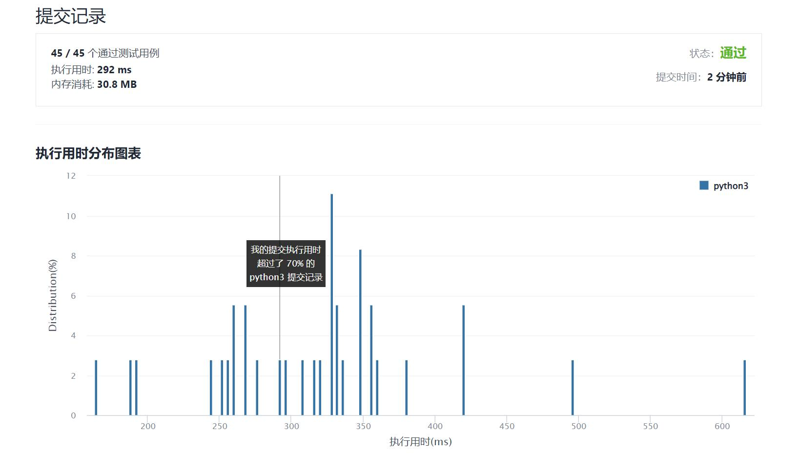

# 1001-网格照明

Author：_Mumu

创建日期：2022/02/08

通过日期：2022/02/08

*****

踩过的坑：

1. 很烦。。
2. 想到了用行列对角线来检查，但是理解错了题意，以为查询时要把周围的灯都记为灭。。
3. 一看题解才发现是把开着的灯都关掉，简单多了。。

已解决：246/2522

*****

难度：困难

问题描述：

在大小为 n x n 的网格 grid 上，每个单元格都有一盏灯，最初灯都处于 关闭 状态。

给你一个由灯的位置组成的二维数组 lamps ，其中 lamps[i] = [rowi, coli] 表示 打开 位于 grid[rowi][coli] 的灯。即便同一盏灯可能在 lamps 中多次列出，不会影响这盏灯处于 打开 状态。

当一盏灯处于打开状态，它将会照亮 自身所在单元格 以及同一 行 、同一 列 和两条 对角线 上的 所有其他单元格 。

另给你一个二维数组 queries ，其中 queries[j] = [rowj, colj] 。对于第 j 个查询，如果单元格 [rowj, colj] 是被照亮的，则查询结果为 1 ，否则为 0 。在第 j 次查询之后 [按照查询的顺序] ，关闭 位于单元格 grid[rowj][colj] 上及相邻 8 个方向上（与单元格 grid[rowi][coli] 共享角或边）的任何灯。

返回一个整数数组 ans 作为答案， ans[j] 应等于第 j 次查询 queries[j] 的结果，1 表示照亮，0 表示未照亮。

 

示例 1：

输入：n = 5, lamps = [[0,0],[4,4]], queries = [[1,1],[1,0]]
输出：[1,0]
解释：最初所有灯都是关闭的。在执行查询之前，打开位于 [0, 0] 和 [4, 4] 的灯。第 0 次查询检查 grid[1][1] 是否被照亮（蓝色方框）。该单元格被照亮，所以 ans[0] = 1 。然后，关闭红色方框中的所有灯。

第 1 次查询检查 grid[1][0] 是否被照亮（蓝色方框）。该单元格没有被照亮，所以 ans[1] = 0 。然后，关闭红色矩形中的所有灯。

示例 2：

输入：n = 5, lamps = [[0,0],[4,4]], queries = [[1,1],[1,1]]
输出：[1,1]
示例 3：

输入：n = 5, lamps = [[0,0],[0,4]], queries = [[0,4],[0,1],[1,4]]
输出：[1,1,0]

提示：

1 <= n <= 109
0 <= lamps.length <= 20000
0 <= queries.length <= 20000
lamps[i].length == 2
0 <= rowi, coli < n
queries[j].length == 2
0 <= rowj, colj < n

来源：力扣（LeetCode）
链接：https://leetcode-cn.com/problems/grid-illumination
