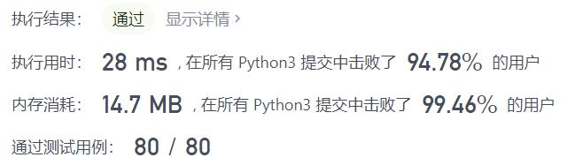
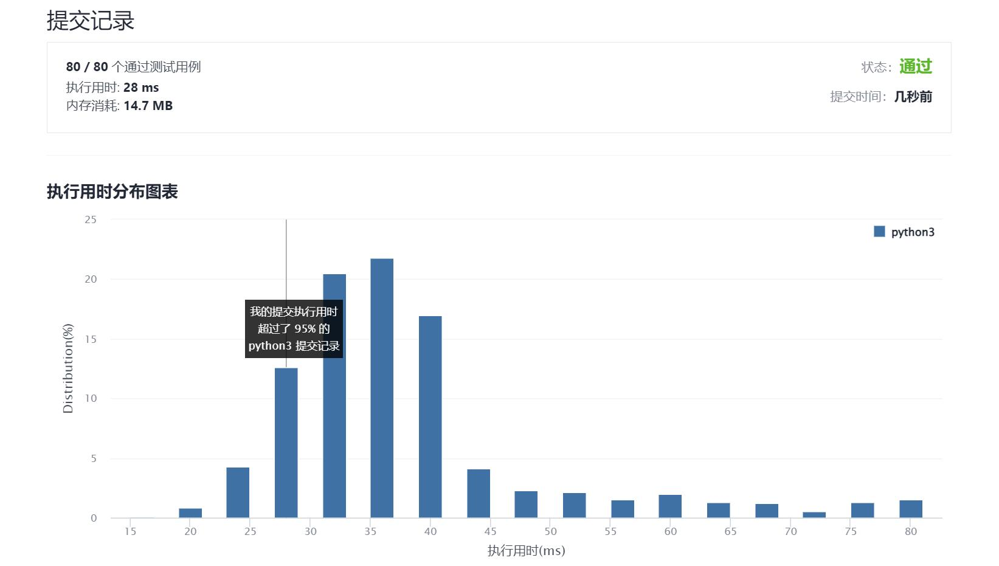

# 1005-K次取反后最大化的数组和

Author：_Mumu

创建日期：2021/12/03

通过日期：2021/12/03

*****

踩过的坑：

1. 轻松愉快！
2. 十二月快乐！
3. 对于$k$大于负数个数的没啥好说的，负数转正，剩余操作次数偶数时直接返回求和，为奇数时把转正后的序列最小值取反即可
4. 对于$k$小于负数个数的情况，第一反应是排序，然后把最小的$k$个负数取反即可
5. 但是由于题目给的数据范围较小，为$[-100,100]$而数组长度最大可能为$10^4$，所以此时使用`Counter`计数后直接在范围内遍历相比排序要更快

已解决：165/2447

*****

难度：简单

问题描述：

给你一个整数数组 nums 和一个整数 k ，按以下方法修改该数组：

选择某个下标 i 并将 nums[i] 替换为 -nums[i] 。
重复这个过程恰好 k 次。可以多次选择同一个下标 i 。

以这种方式修改数组后，返回数组 可能的最大和 。

 

示例 1：

输入：nums = [4,2,3], k = 1
输出：5
解释：选择下标 1 ，nums 变为 [4,-2,3] 。
示例 2：

输入：nums = [3,-1,0,2], k = 3
输出：6
解释：选择下标 (1, 2, 2) ，nums 变为 [3,1,0,2] 。
示例 3：

输入：nums = [2,-3,-1,5,-4], k = 2
输出：13
解释：选择下标 (1, 4) ，nums 变为 [2,3,-1,5,4] 。

提示：

1 <= nums.length <= 104
-100 <= nums[i] <= 100
1 <= k <= 104

来源：力扣（LeetCode）
链接：https://leetcode-cn.com/problems/maximize-sum-of-array-after-k-negations
