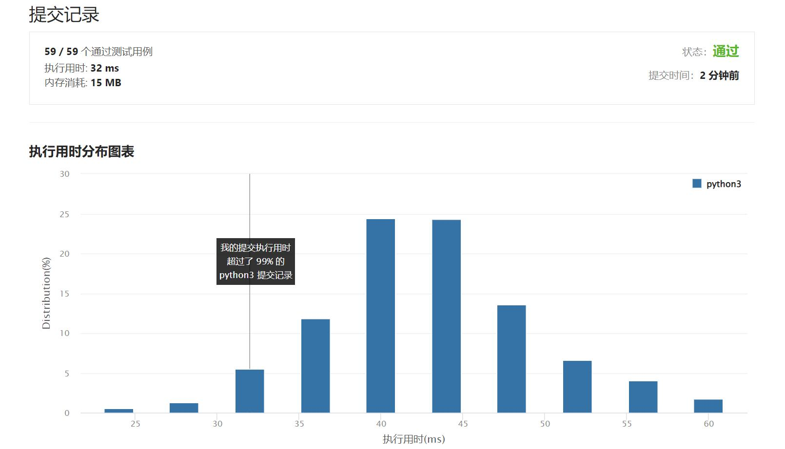

# 1021-删除最外层的括号

Author：_Mumu

创建日期：2022/05/28

通过日期：2022/05/28

*****

踩过的坑：

1. 轻松愉快
1. 处理括号就用栈，只有一种括号时计数即可

已解决：353/2648

*****

难度：简单

问题描述：

有效括号字符串为空 ""、"(" + A + ")" 或 A + B ，其中 A 和 B 都是有效的括号字符串，+ 代表字符串的连接。

例如，""，"()"，"(())()" 和 "(()(()))" 都是有效的括号字符串。
如果有效字符串 s 非空，且不存在将其拆分为 s = A + B 的方法，我们称其为原语（primitive），其中 A 和 B 都是非空有效括号字符串。

给出一个非空有效字符串 s，考虑将其进行原语化分解，使得：s = P_1 + P_2 + ... + P_k，其中 P_i 是有效括号字符串原语。

对 s 进行原语化分解，删除分解中每个原语字符串的最外层括号，返回 s 。

 

示例 1：

输入：s = "(()())(())"
输出："()()()"
解释：
输入字符串为 "(()())(())"，原语化分解得到 "(()())" + "(())"，
删除每个部分中的最外层括号后得到 "()()" + "()" = "()()()"。
示例 2：

输入：s = "(()())(())(()(()))"
输出："()()()()(())"
解释：
输入字符串为 "(()())(())(()(()))"，原语化分解得到 "(()())" + "(())" + "(()(()))"，
删除每个部分中的最外层括号后得到 "()()" + "()" + "()(())" = "()()()()(())"。
示例 3：

输入：s = "()()"
输出：""
解释：
输入字符串为 "()()"，原语化分解得到 "()" + "()"，
删除每个部分中的最外层括号后得到 "" + "" = ""。

提示：

1 <= s.length <= 105
s[i] 为 '(' 或 ')'
s 是一个有效括号字符串

来源：力扣（LeetCode）
链接：https://leetcode.cn/problems/remove-outermost-parentheses