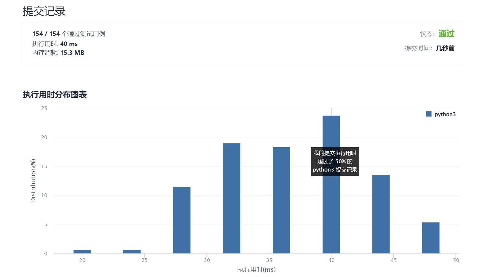

# 1034-边界着色

Author：_Mumu

创建日期：2021/12/07

通过日期：2021/12/07

*****

踩过的坑：

1. 轻松愉快！
2. 十二月快乐！
3. 使用最开始只包含初始点的集合表示当前边界，从初始点向外扩散寻找连通分量的边界，创建新的集合作为下一轮遍历对象，原集合中是边界的点加入新集合， 原集合中点周围未被访问过且着色与初始点相同的点也加入新集合，若新集合与原集合相同则迭代结束，否则使用新集合进行下一轮迭代
4. 不过好像还是写个队列比较好，这样就不会一直重复遍历早就找到的边界点，而另外使用一个列表来存储边界点

已解决：169/2449

*****

难度：中等

问题描述：

给你一个大小为 m x n 的整数矩阵 grid ，表示一个网格。另给你三个整数 row、col 和 color 。网格中的每个值表示该位置处的网格块的颜色。

当两个网格块的颜色相同，而且在四个方向中任意一个方向上相邻时，它们属于同一 连通分量 。

连通分量的边界 是指连通分量中的所有与不在分量中的网格块相邻（四个方向上）的所有网格块，或者在网格的边界上（第一行/列或最后一行/列）的所有网格块。

请你使用指定颜色 color 为所有包含网格块 grid[row][col] 的 连通分量的边界 进行着色，并返回最终的网格 grid 。

 

示例 1：

输入：grid = [[1,1],[1,2]], row = 0, col = 0, color = 3
输出：[[3,3],[3,2]]
示例 2：

输入：grid = [[1,2,2],[2,3,2]], row = 0, col = 1, color = 3
输出：[[1,3,3],[2,3,3]]
示例 3：

输入：grid = [[1,1,1],[1,1,1],[1,1,1]], row = 1, col = 1, color = 2
输出：[[2,2,2],[2,1,2],[2,2,2]]

提示：

m == grid.length
n == grid[i].length
1 <= m, n <= 50
1 <= grid[i][j], color <= 1000
0 <= row < m
0 <= col < n

来源：力扣（LeetCode）
链接：https://leetcode-cn.com/problems/coloring-a-border
