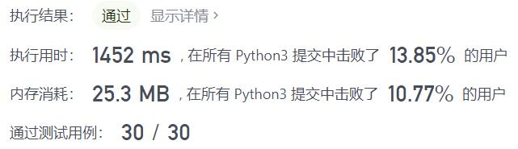
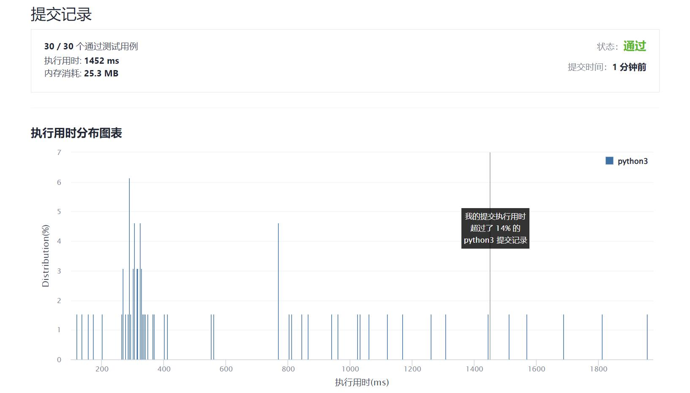

# 1036-逃离大迷宫

Author：_Mumu

创建日期：2022/01/11

通过日期：2022/01/11

*****

踩过的坑：

1. 确实好难
2. 面向数据范围编程，因为障碍物数量有限记为$n$，障碍物围成的最大面积为$\frac{n(n-1)}{2}$，那么在还没找到终点的同时，只要从起点遍历到的格点超过这个数字就表示起点没有被围住；同时如果终点也没有被围住，就说明两者一定能相遇；如果二者之一被围住就说明二者之间没有通路
3. 还有一种更牛逼的解法是使用并查集维护障碍的连通性，再用并查集维护所有障碍周围格点的连通性，然后任选一条从起点向终点的路径，检测进出包围圈的次数是否相同，如果相同则两点连通
4. 学习了一下并查集，很酷

已解决：204/2491

*****

难度：困难

问题描述：

在一个 106 x 106 的网格中，每个网格上方格的坐标为 (x, y) 。

现在从源方格 source = [sx, sy] 开始出发，意图赶往目标方格 target = [tx, ty] 。数组 blocked 是封锁的方格列表，其中每个 blocked[i] = [xi, yi] 表示坐标为 (xi, yi) 的方格是禁止通行的。

每次移动，都可以走到网格中在四个方向上相邻的方格，只要该方格 不 在给出的封锁列表 blocked 上。同时，不允许走出网格。

只有在可以通过一系列的移动从源方格 source 到达目标方格 target 时才返回 true。否则，返回 false。

 

示例 1：

输入：blocked = [[0,1],[1,0]], source = [0,0], target = [0,2]
输出：false
解释：
从源方格无法到达目标方格，因为我们无法在网格中移动。
无法向北或者向东移动是因为方格禁止通行。
无法向南或者向西移动是因为不能走出网格。
示例 2：

输入：blocked = [], source = [0,0], target = [999999,999999]
输出：true
解释：
因为没有方格被封锁，所以一定可以到达目标方格。

提示：

0 <= blocked.length <= 200
blocked[i].length == 2
0 <= xi, yi < 106
source.length == target.length == 2
0 <= sx, sy, tx, ty < 106
source != target
题目数据保证 source 和 target 不在封锁列表内

来源：力扣（LeetCode）
链接：https://leetcode-cn.com/problems/escape-a-large-maze
