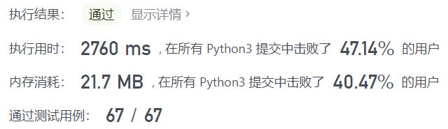
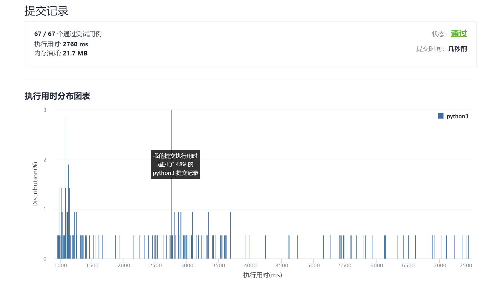

# 1044-最长重复子串

Author：_Mumu

创建日期：2021/12/23

通过日期：2021/12/23

*****

踩过的坑：

1. 好难。。
2. 照着写一遍才发现二分分的是重复子串得长度，牛逼
3. 细节上字符串编码的思想也很牛逼
4. 之后一定要搞懂它

已解决：185/2468

*****

难度：困难

问题描述：

给你一个字符串 s ，考虑其所有 重复子串 ：即，s 的连续子串，在 s 中出现 2 次或更多次。这些出现之间可能存在重叠。

返回 任意一个 可能具有最长长度的重复子串。如果 s 不含重复子串，那么答案为 "" 。

 

示例 1：

输入：s = "banana"
输出："ana"
示例 2：

输入：s = "abcd"
输出：""

提示：

2 <= s.length <= 3 * 104
s 由小写英文字母组成

来源：力扣（LeetCode）
链接：https://leetcode-cn.com/problems/longest-duplicate-substring
