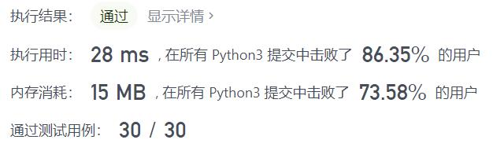
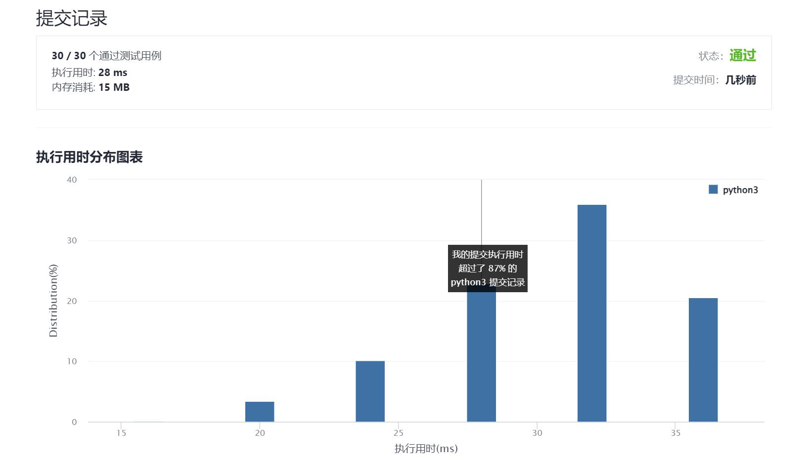

# 1078-Bigram分词

Author：_Mumu

创建日期：2021/12/26

通过日期：2021/12/26

*****

踩过的坑：

1. 单纯想试试能不能只用一个变量来处理所有判断
2. 一共有三种状态：`-1`表示未匹配到`first`；`0`表示匹配到`first`；`1`表示匹配到`first`的同时又匹配到了`second`
3. 每一次循环都先判断状态是否为`1`，若是，则添加答案，并重新修改状态
4. 考虑到可能有连着出现`first`的情况，`second`后可能又出现`first`的情况，状态修改逻辑可以归纳为：若状态为`0`且匹配到`second`，修改状态为`1`；否则若匹配到`first`，修改状态为`0`；否则修改状态为`-1`
5. 但必须要注意，在状态为`1`，添加答案后，还须根据两单词是否相同来选择状态修改回哪一种：若`first == second`则回到状态`0`，否则回到状态`-1`，而后再根据第四条的逻辑判断当前单词属于哪种状态

已解决：188/2468

*****

难度：简单

问题描述：

给出第一个词 first 和第二个词 second，考虑在某些文本 text 中可能以 "first second third" 形式出现的情况，其中 second 紧随 first 出现，third 紧随 second 出现。

对于每种这样的情况，将第三个词 "third" 添加到答案中，并返回答案。

 

示例 1：

输入：text = "alice is a good girl she is a good student", first = "a", second = "good"
输出：["girl","student"]
示例 2：

输入：text = "we will we will rock you", first = "we", second = "will"
输出：["we","rock"]

提示：

1 <= text.length <= 1000
text 由小写英文字母和空格组成
text 中的所有单词之间都由 单个空格字符 分隔
1 <= first.length, second.length <= 10
first 和 second 由小写英文字母组成

来源：力扣（LeetCode）
链接：https://leetcode-cn.com/problems/occurrences-after-bigram
