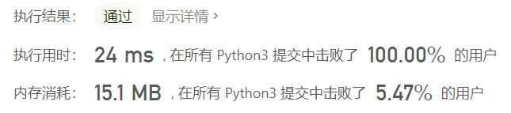
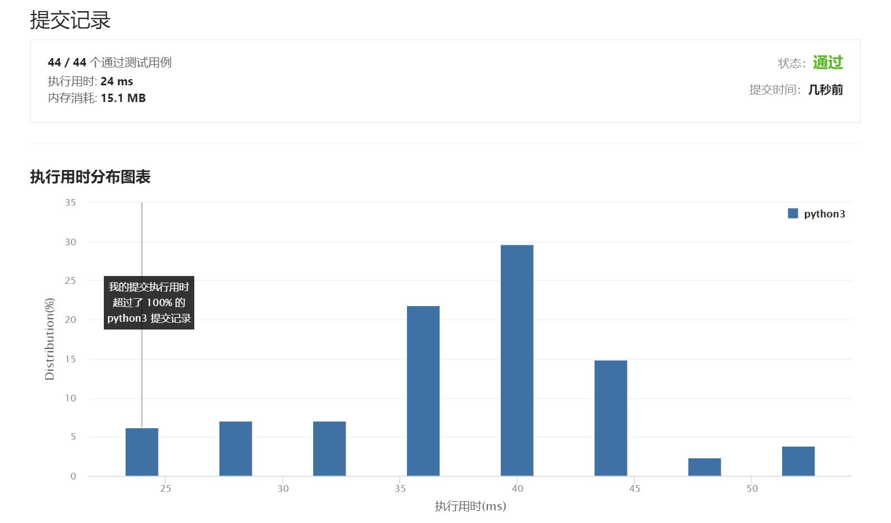

# 1104-二叉树寻路

Author：_Mumu

创建日期：2021/7/29

通过日期：2021/7/29

*****

踩过的坑：

1. 第一反应是根据行数奇偶性来判断该行元素的排列方式，判断所在的是根节点的左子树还是右子树，然后砍掉另一子树，再依次判断左右
2. 太麻烦了，但是这衍生出另一个想法，就是将偶数行先反向，成为一个每行都从左到右排列的二叉树，在该树上寻找目标节点的位置，然后将路径上行数奇偶性与目标节点所在行不同的节点改为在该行与其左右对称的节点
3. 然后突然想到，对称节点与原节点可能在二进制下为反码的可能，把所有数字转换为二进制，写了一下发现一个很有意思的规律！
4. 在一个所有行都是从左到右排列的二叉树中，把数字全部使用二进制表示，那么每个节点的父节点与该节点删去末位后余下的数字完全相同，例如：6(110)为3(11)的左子节点，11(1011)为5(101)的右子节点，这个规律的正确性是很容易证明的
5. 于是只要将目标节点的二进制每次删去一位末位，就能得到该节点在正常排列的二叉树中的路径
6. 现在只需将路径中的所在行数奇偶性与目标节点不同的节点改为对称节点即可
7. 这时只要利用，对称节点与原节点除首位外，其余都互为反码，这一性质，即可找到蛇形排列的二叉树中的目标路径
8. 靠自己的思考秒杀100%，很爽

已解决：56/2175

*****

难度：中等

问题描述：

在一棵无限的二叉树上，每个节点都有两个子节点，树中的节点 逐行 依次按 “之” 字形进行标记。

如下图所示，在奇数行（即，第一行、第三行、第五行……）中，按从左到右的顺序进行标记；

而偶数行（即，第二行、第四行、第六行……）中，按从右到左的顺序进行标记。

给你树上某一个节点的标号 label，请你返回从根节点到该标号为 label 节点的路径，该路径是由途经的节点标号所组成的。

 

示例 1：

输入：label = 14
输出：[1,3,4,14]
示例 2：

输入：label = 26
输出：[1,2,6,10,26]

提示：

1 <= label <= 10^6

来源：力扣（LeetCode）
链接：https://leetcode-cn.com/problems/path-in-zigzag-labelled-binary-tree