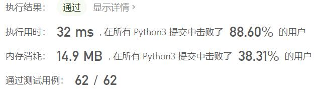
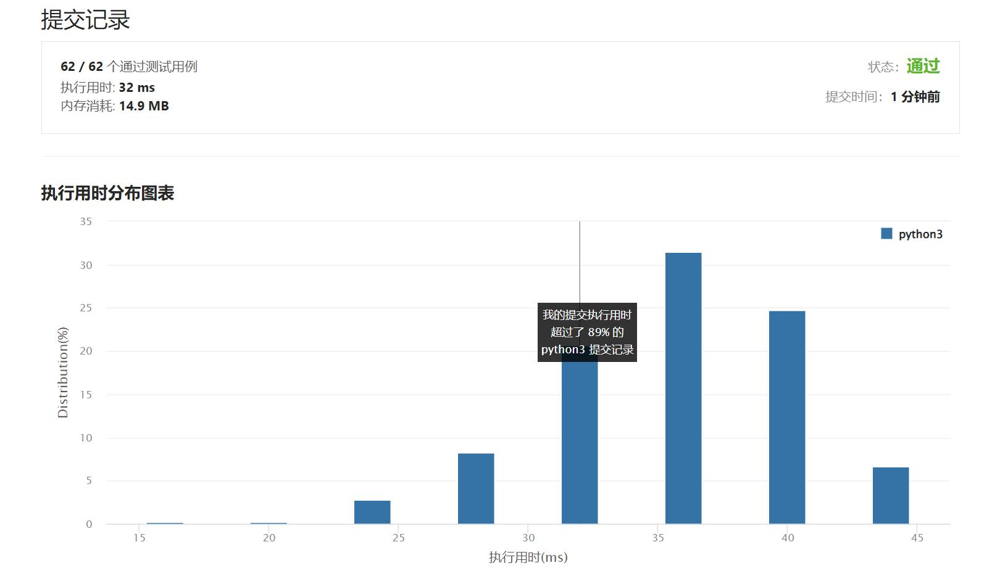

# 1108-IP地址无效化

Author：_Mumu

创建日期：2022/06/21

通过日期：2022/06/21

*****

踩过的坑：

1. 轻松愉快（指题还没念完就写完了

已解决：376/2678

*****

难度：简单

问题描述：

给你一个有效的 IPv4 地址 address，返回这个 IP 地址的无效化版本。

所谓无效化 IP 地址，其实就是用 "[.]" 代替了每个 "."。

 

示例 1：

输入：address = "1.1.1.1"
输出："1[.]1[.]1[.]1"
示例 2：

输入：address = "255.100.50.0"
输出："255[.]100[.]50[.]0"

提示：

给出的 address 是一个有效的 IPv4 地址

来源：力扣（LeetCode）
链接：https://leetcode.cn/problems/defanging-an-ip-address