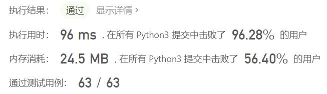
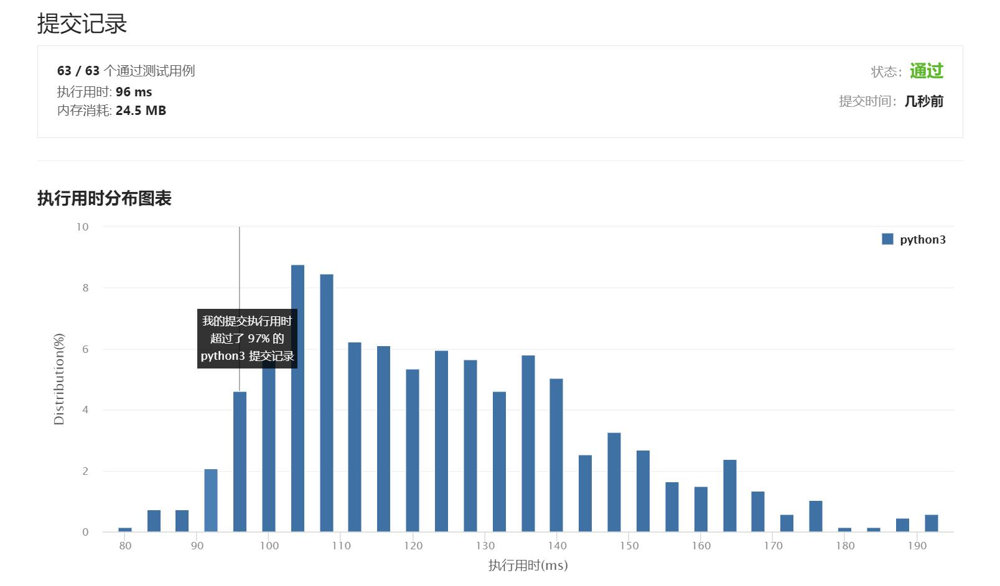

# 1109-航班预订统计

Author：_Mumu

创建日期：2021/8/31

通过日期：2021/8/31

*****

踩过的坑：

1. 一开始暴力解，那显然要超时的
2. 然后一思考，感觉好像跟之前的《218-天际线问题》差不多，然后尝试了一下，发现自己已经忘记怎么编了，遂看题解
3. 结果发现可以用差分数组直接搞定
4. 太精妙了
5. 那天际线问题岂不是也可以用差分数组完成？
6. 看了一眼，好像是可以的哦
7. ummm，不行，最大坐标可能到$2^{31}-1$，这样用差分数组的话内存占用会爆的，而且如果只有一栋长度为$2^{31}-1$的建筑，那时间消耗也过大了
8. 天际线评论区有一个说自己想的方法超内存限制了，怕不是就是差分数组喔...

已解决：72/2332

*****

难度：中等

问题描述：

这里有 n 个航班，它们分别从 1 到 n 进行编号。

有一份航班预订表 bookings ，表中第 i 条预订记录 bookings[i] = [firsti, lasti, seatsi] 意味着在从 firsti 到 lasti （包含 firsti 和 lasti ）的 每个航班 上预订了 seatsi 个座位。

请你返回一个长度为 n 的数组 answer，其中 answer[i] 是航班 i 上预订的座位总数。

 

示例 1：

输入：bookings = [[1,2,10],[2,3,20],[2,5,25]], n = 5
输出：[10,55,45,25,25]
解释：
航班编号        1   2   3   4   5
预订记录 1 ：   10  10
预订记录 2 ：       20  20
预订记录 3 ：       25  25  25  25
总座位数：      10  55  45  25  25
因此，answer = [10,55,45,25,25]
示例 2：

输入：bookings = [[1,2,10],[2,2,15]], n = 2
输出：[10,25]
解释：
航班编号        1   2
预订记录 1 ：   10  10
预订记录 2 ：       15
总座位数：      10  25
因此，answer = [10,25]

提示：

1 <= n <= 2 * 104
1 <= bookings.length <= 2 * 104
bookings[i].length == 3
1 <= firsti <= lasti <= n
1 <= seatsi <= 104

来源：力扣（LeetCode）
链接：https://leetcode-cn.com/problems/corporate-flight-bookings
