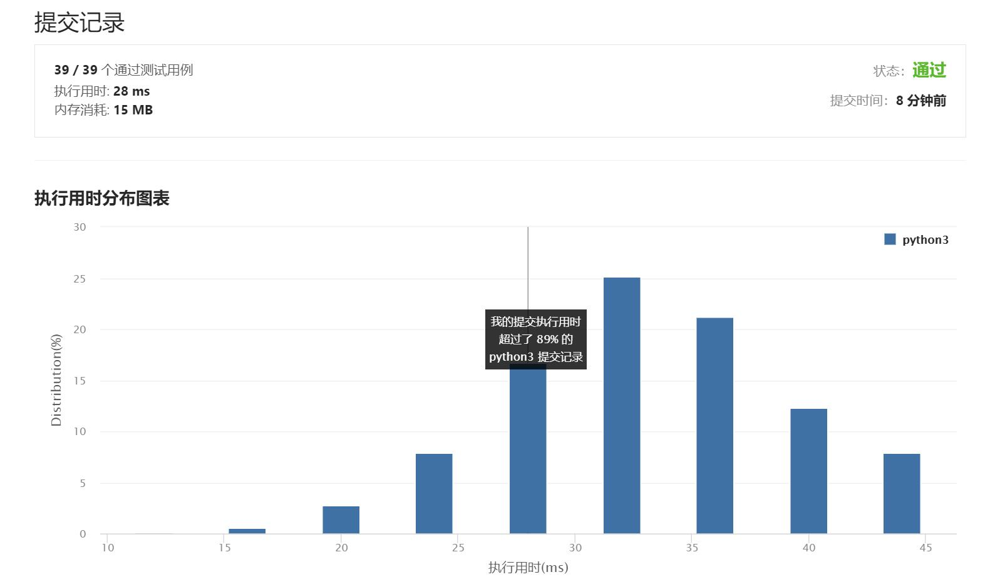

# 1137-第N个泰波那契数

Author：_Mumu

创建日期：2021/8/8

通过日期：2021/8/8

*****

踩过的坑：

1. 用大小为3的数组节省了空间，但是需要通过模3来判断需要计算哪个数
2. 滚动数组优势在于数据存储的方向与n递增的方向是一致的，不需要额外判断需要计算的是哪个数字
3. 矩阵乘法加速有点意思，但是没仔细看

已解决：62/2299

*****

难度：简单

问题描述：

泰波那契序列 Tn 定义如下： 

T0 = 0, T1 = 1, T2 = 1, 且在 n >= 0 的条件下 Tn+3 = Tn + Tn+1 + Tn+2

给你整数 n，请返回第 n 个泰波那契数 Tn 的值。

 

示例 1：

输入：n = 4
输出：4
解释：
T_3 = 0 + 1 + 1 = 2
T_4 = 1 + 1 + 2 = 4
示例 2：

输入：n = 25
输出：1389537

提示：

0 <= n <= 37
答案保证是一个 32 位整数，即 answer <= 2^31 - 1。

来源：力扣（LeetCode）
链接：https://leetcode-cn.com/problems/n-th-tribonacci-number
