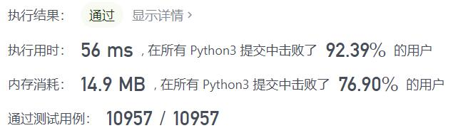
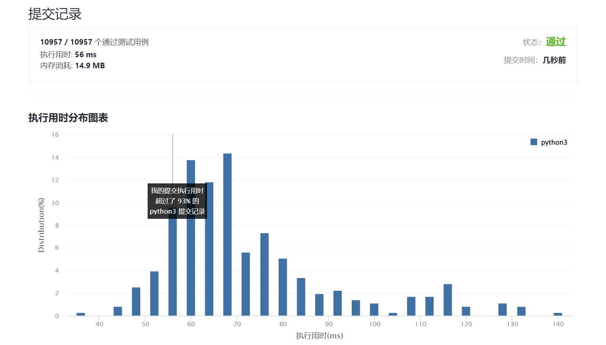

# 1154-一年中的第几天

Author：_Mumu

创建日期：2021/12/21

通过日期：2021/12/21

*****

踩过的坑：

1. 轻松愉快！
2. 冬至快乐！
3. 期待2022！

已解决：183/2467

*****

难度：简单

问题描述：

给你一个字符串 date ，按 YYYY-MM-DD 格式表示一个 现行公元纪年法 日期。请你计算并返回该日期是当年的第几天。

通常情况下，我们认为 1 月 1 日是每年的第 1 天，1 月 2 日是每年的第 2 天，依此类推。每个月的天数与现行公元纪年法（格里高利历）一致。

 

示例 1：

输入：date = "2019-01-09"
输出：9
示例 2：

输入：date = "2019-02-10"
输出：41
示例 3：

输入：date = "2003-03-01"
输出：60
示例 4：

输入：date = "2004-03-01"
输出：61

提示：

date.length == 10
date[4] == date[7] == '-'，其他的 date[i] 都是数字
date 表示的范围从 1900 年 1 月 1 日至 2019 年 12 月 31 日

来源：力扣（LeetCode）
链接：https://leetcode-cn.com/problems/day-of-the-year
