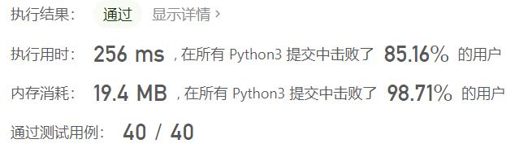
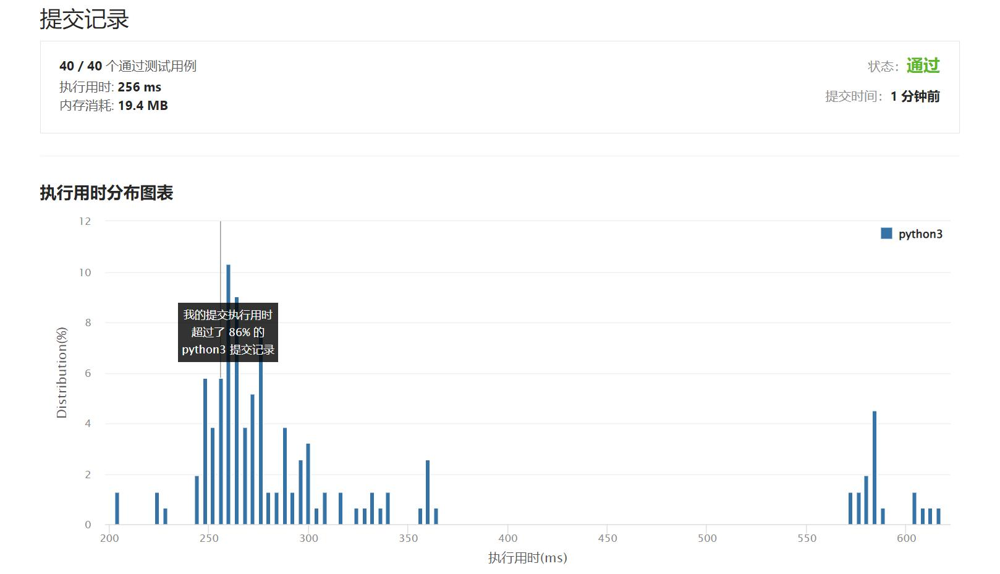

# 1161-最大层内元素和

Author：_Mumu

创建日期：2022/07/31

通过日期：2022/07/31

*****

踩过的坑：

1. 轻松愉快
1. 简单的bfs，记得层空的时候不要计算和

已解决：417/2722

*****

难度：中等

问题描述：

给你一个二叉树的根节点 root。设根节点位于二叉树的第 1 层，而根节点的子节点位于第 2 层，依此类推。

请返回层内元素之和 最大 的那几层（可能只有一层）的层号，并返回其中 最小 的那个。

 

示例 1：

输入：root = [1,7,0,7,-8,null,null]
输出：2
解释：
第 1 层各元素之和为 1，
第 2 层各元素之和为 7 + 0 = 7，
第 3 层各元素之和为 7 + -8 = -1，
所以我们返回第 2 层的层号，它的层内元素之和最大。
示例 2：

输入：root = [989,null,10250,98693,-89388,null,null,null,-32127]
输出：2

提示：

树中的节点数在 [1, 104]范围内
-105 <= Node.val <= 105

来源：力扣（LeetCode）
链接：https://leetcode.cn/problems/maximum-level-sum-of-a-binary-tree