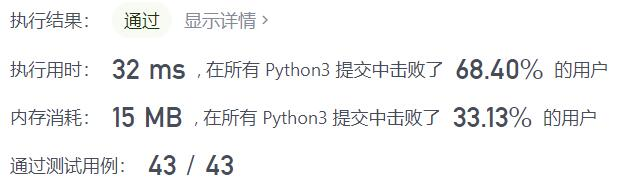
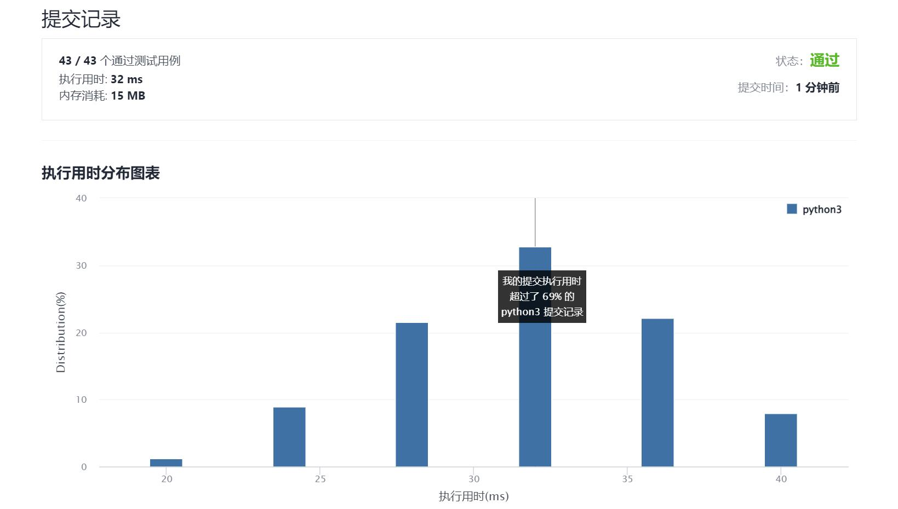

# 1185-一周中的第几天

Author：_Mumu

创建日期：2022/01/03

通过日期：2022/01/03

*****

踩过的坑：

1. 反正都要模7，不如一开始就模好
2. 月份处理上和【1154-一年中的第几天】一样选择先做好前缀和，不同在于该题中使用的是前缀和模7的数值
3. `week`从周四开始是因为1971.1.1是周五

已解决：196/2482

*****

难度：简单

问题描述：

给你一个日期，请你设计一个算法来判断它是对应一周中的哪一天。

输入为三个整数：day、month 和 year，分别表示日、月、年。

您返回的结果必须是这几个值中的一个 {"Sunday", "Monday", "Tuesday", "Wednesday", "Thursday", "Friday", "Saturday"}。

 

示例 1：

输入：day = 31, month = 8, year = 2019
输出："Saturday"
示例 2：

输入：day = 18, month = 7, year = 1999
输出："Sunday"
示例 3：

输入：day = 15, month = 8, year = 1993
输出："Sunday"

提示：

给出的日期一定是在 1971 到 2100 年之间的有效日期。

来源：力扣（LeetCode）
链接：https://leetcode-cn.com/problems/day-of-the-week
