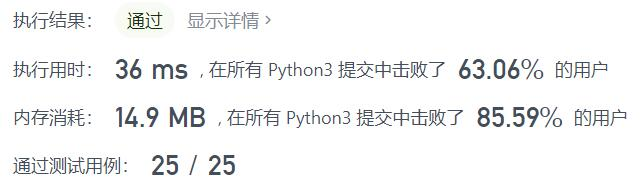
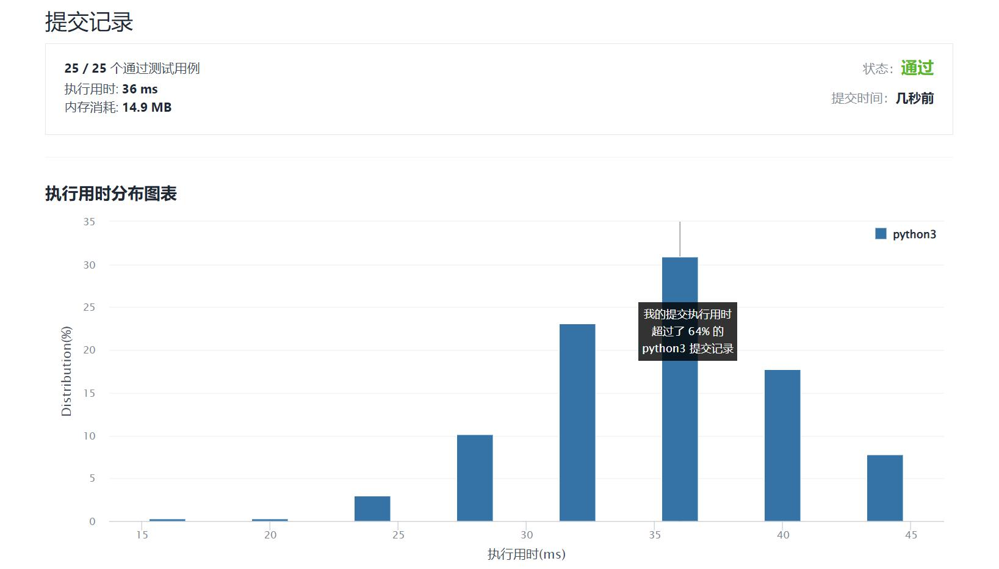

# 1189-“气球”的最大数量

Author：_Mumu

创建日期：2022/02/13

通过日期：2022/02/13

*****

踩过的坑：

1. 简单的`Counter`

已解决：251/2523

*****

难度：简单

问题描述：

给你一个字符串 text，你需要使用 text 中的字母来拼凑尽可能多的单词 "balloon"（气球）。

字符串 text 中的每个字母最多只能被使用一次。请你返回最多可以拼凑出多少个单词 "balloon"。

 

示例 1：

输入：text = "nlaebolko"
输出：1
示例 2：

输入：text = "loonbalxballpoon"
输出：2
示例 3：

输入：text = "leetcode"
输出：0

提示：

1 <= text.length <= 10^4
text 全部由小写英文字母组成

来源：力扣（LeetCode）
链接：https://leetcode-cn.com/problems/maximum-number-of-balloons
