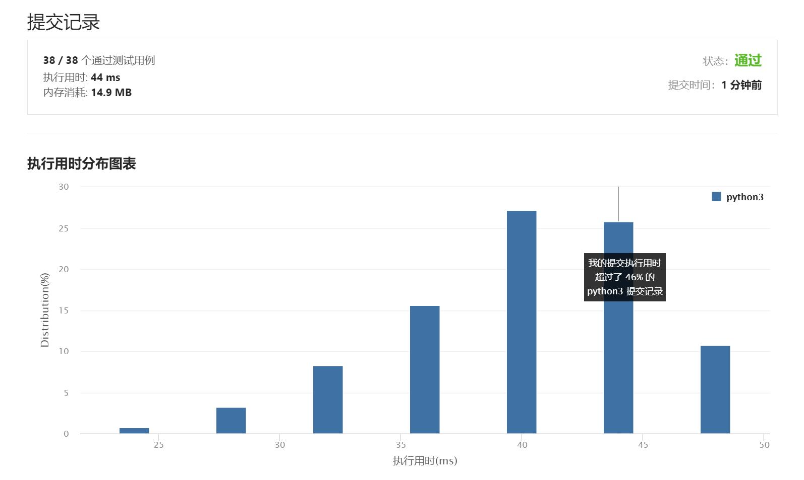

# 1190-反转每对括号间的子串

Author：_Mumu

创建日期：2021/5/26

通过日期：2021/5/27

*****

踩过的坑：

1. 太难了，知道怎么解决问题但是不知道怎么写进代码里，看了题解里大佬的评论的答案才知道应该怎么写，然后在提交详情看到了更好的写法；
2. 但是好像找不到解法二的解答诶，是Python太难实现了吗？至少我自己是没能实现出来呜呜qaq

已解决：23/2095

*****

难度：中等

问题描述：

给出一个字符串 s（仅含有小写英文字母和括号）。

请你按照从括号内到外的顺序，逐层反转每对匹配括号中的字符串，并返回最终的结果。

注意，您的结果中 不应 包含任何括号。

 

示例 1：

输入：s = "(abcd)"
输出："dcba"
示例 2：

输入：s = "(u(love)i)"
输出："iloveu"
示例 3：

输入：s = "(ed(et(oc))el)"
输出："leetcode"
示例 4：

输入：s = "a(bcdefghijkl(mno)p)q"
输出："apmnolkjihgfedcbq"

提示：

0 <= s.length <= 2000
s 中只有小写英文字母和括号
我们确保所有括号都是成对出现的

来源：力扣（LeetCode）
链接：https://leetcode-cn.com/problems/reverse-substrings-between-each-pair-of-parentheses