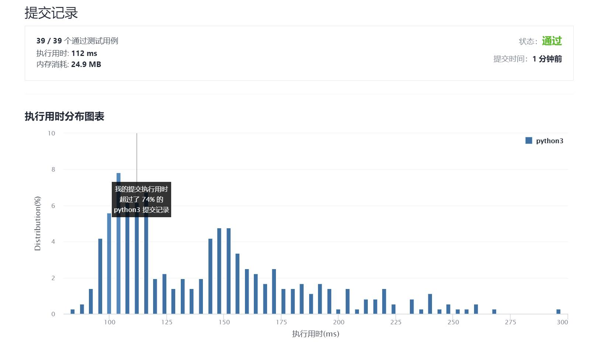

# 1218-最长定差子序列

Author：_Mumu

创建日期：2021/11/05

通过日期：2021/11/05

*****

踩过的坑：

1. 不得不说，牛啊
2. 一开始想到了可能是dp，但是想不出到底dp什么
3. 看了题解知道是dp了之后自己写了一个结果没有优化超时了
4. 主要耗时还是在查询这一块上
5. 所以为了让查询更便捷，应使用哈希表
6. 之前其实做过哈希表的这种用法的
7. 希望下次能自己写出优质的dp

已解决：142/2416

*****

难度：中等

问题描述：

给你一个整数数组 arr 和一个整数 difference，请你找出并返回 arr 中最长等差子序列的长度，该子序列中相邻元素之间的差等于 difference 。

子序列 是指在不改变其余元素顺序的情况下，通过删除一些元素或不删除任何元素而从 arr 派生出来的序列。

 

示例 1：

输入：arr = [1,2,3,4], difference = 1
输出：4
解释：最长的等差子序列是 [1,2,3,4]。
示例 2：

输入：arr = [1,3,5,7], difference = 1
输出：1
解释：最长的等差子序列是任意单个元素。
示例 3：

输入：arr = [1,5,7,8,5,3,4,2,1], difference = -2
输出：4
解释：最长的等差子序列是 [7,5,3,1]。

提示：

1 <= arr.length <= 105
-104 <= arr[i], difference <= 104

来源：力扣（LeetCode）
链接：https://leetcode-cn.com/problems/longest-arithmetic-subsequence-of-given-difference
