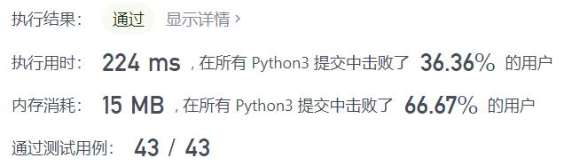
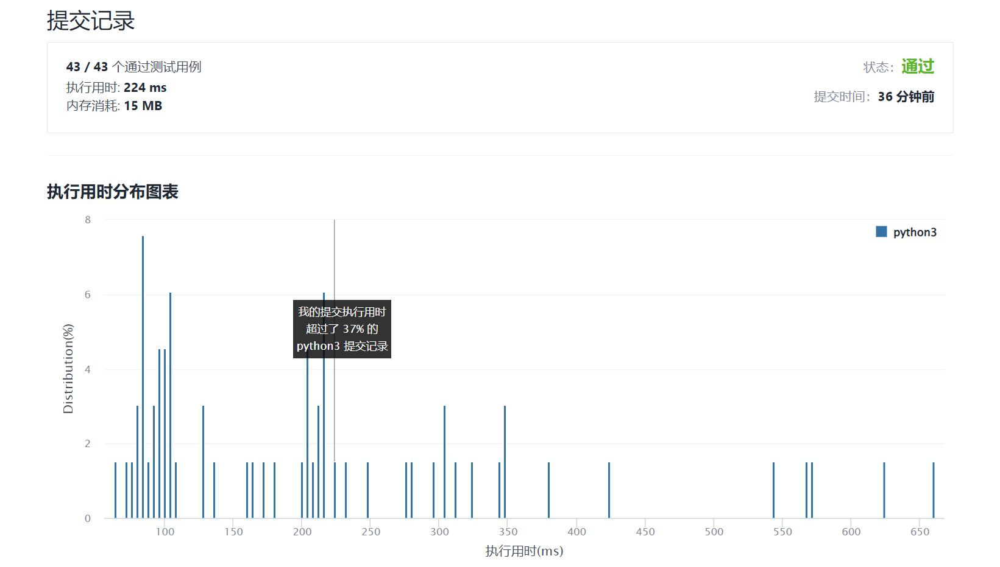

# 1220-统计元音字母序列的数目

Author：_Mumu

创建日期：2022/01/17

通过日期：2022/01/17

*****

踩过的坑：

1. 第一反应是可以按尾部字符分类，首先通过题目向后传递的转移方式倒推出一个向前传递的转移方式；若最后一个字符是a，则前一个字符可为e、i、u，则长度为$n$尾部为a的不同字符串数目$f_{n,a}=f_{n-1,e}+f_{n-1,i}+f_{n-1,u}$；同理计算其他字符，则有总数$f_n=\sum_{c\in\{a,e,i,o,u\}}f_{n,c}$，$f_n$完全可以由$f_{n-1}$得出，则实现时只需存储五个值，然后进行滚动即可
2. 看了题解我想的方法就是动态规划
3. 没想到的是还可以矩阵快速幂。。
4. 确实，由$f_{n-1}$推出$f_n$的过程完全可以用矩阵乘法运算代替，牛逼
5. 没想到的是。。。。最快的算法我完全看不懂。。。。这tm是怎么得到这不依靠字符分类直接一个数列递推公式的。。。。

已解决：210/2497

*****

难度：困难

问题描述：

给你一个整数 n，请你帮忙统计一下我们可以按下述规则形成多少个长度为 n 的字符串：

字符串中的每个字符都应当是小写元音字母（'a', 'e', 'i', 'o', 'u'）
每个元音 'a' 后面都只能跟着 'e'
每个元音 'e' 后面只能跟着 'a' 或者是 'i'
每个元音 'i' 后面 不能 再跟着另一个 'i'
每个元音 'o' 后面只能跟着 'i' 或者是 'u'
每个元音 'u' 后面只能跟着 'a'
由于答案可能会很大，所以请你返回 模 10^9 + 7 之后的结果。

 

示例 1：

输入：n = 1
输出：5
解释：所有可能的字符串分别是："a", "e", "i" , "o" 和 "u"。
示例 2：

输入：n = 2
输出：10
解释：所有可能的字符串分别是："ae", "ea", "ei", "ia", "ie", "io", "iu", "oi", "ou" 和 "ua"。
示例 3：

输入：n = 5
输出：68

提示：

1 <= n <= 2 * 10^4

来源：力扣（LeetCode）
链接：https://leetcode-cn.com/problems/count-vowels-permutation
