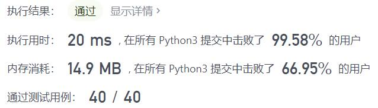
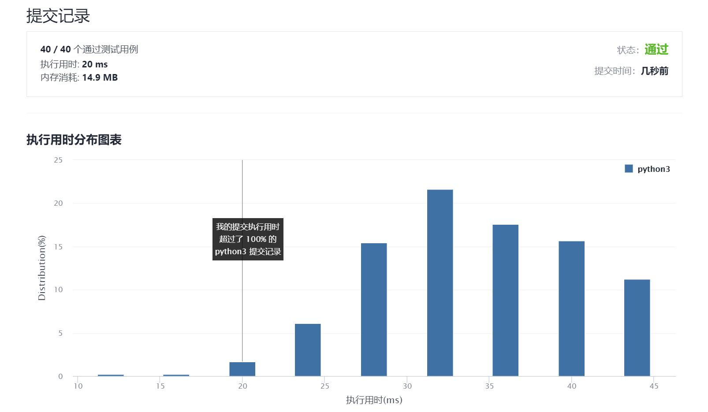

# 1221-分割平衡字符串

Author：_Mumu

创建日期：2021/9/7

通过日期：2021/9/7

*****

踩过的坑：

1. 因为昨天做了有效的括号，所以第一反应是模仿括号做一个栈
2. 然后转念一想，反正只有俩字母，计数不就完了吗，然后就写完了
3. 看了题解，才发现并不需要用两个变量来存储两个字母出现的次数，只需要一种字母+1另一种-1即可达到目的

已解决：83/2342

*****

难度：简单

问题描述：

在一个 平衡字符串 中，'L' 和 'R' 字符的数量是相同的。

给你一个平衡字符串 s，请你将它分割成尽可能多的平衡字符串。

注意：分割得到的每个字符串都必须是平衡字符串。

返回可以通过分割得到的平衡字符串的 最大数量 。

 

示例 1：

输入：s = "RLRRLLRLRL"
输出：4
解释：s 可以分割为 "RL"、"RRLL"、"RL"、"RL" ，每个子字符串中都包含相同数量的 'L' 和 'R' 。
示例 2：

输入：s = "RLLLLRRRLR"
输出：3
解释：s 可以分割为 "RL"、"LLLRRR"、"LR" ，每个子字符串中都包含相同数量的 'L' 和 'R' 。
示例 3：

输入：s = "LLLLRRRR"
输出：1
解释：s 只能保持原样 "LLLLRRRR".
示例 4：

输入：s = "RLRRRLLRLL"
输出：2
解释：s 可以分割为 "RL"、"RRRLLRLL" ，每个子字符串中都包含相同数量的 'L' 和 'R' 。

提示：

1 <= s.length <= 1000
s[i] = 'L' 或 'R'
s 是一个 平衡 字符串

来源：力扣（LeetCode）
链接：https://leetcode-cn.com/problems/split-a-string-in-balanced-strings
