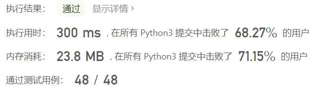
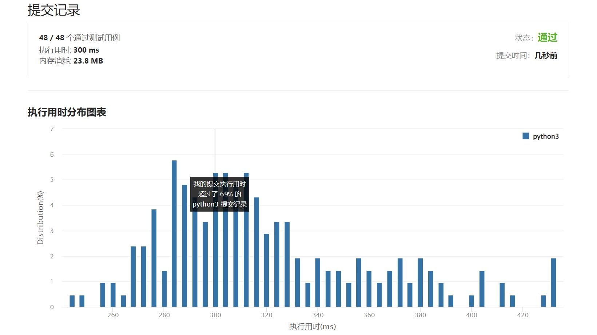

# 1305-两棵二叉搜索树中的所有元素

Author：_Mumu

创建日期：2022/05/01

通过日期：2022/05/01

*****

踩过的坑：

1. 轻松愉快
1. 简单的dfs和一次归并

已解决：326/2624

*****

难度：中等

问题描述：

给你 root1 和 root2 这两棵二叉搜索树。请你返回一个列表，其中包含 两棵树 中的所有整数并按 升序 排序。.

 

示例 1：

输入：root1 = [2,1,4], root2 = [1,0,3]
输出：[0,1,1,2,3,4]
示例 2：

输入：root1 = [1,null,8], root2 = [8,1]
输出：[1,1,8,8]

提示：

每棵树的节点数在 [0, 5000] 范围内
-105 <= Node.val <= 105

来源：力扣（LeetCode）
链接：https://leetcode-cn.com/problems/all-elements-in-two-binary-search-trees