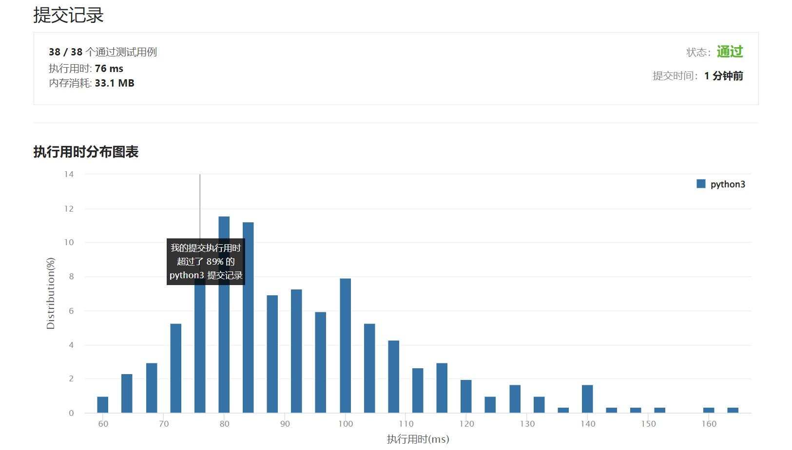

# 1331-数组序号转换

Author：_Mumu

创建日期：2022/07/28

通过日期：2022/07/28

*****

踩过的坑：

1. 轻松愉快

已解决：414/2721

*****

难度：简单

问题描述：

给你一个整数数组 arr ，请你将数组中的每个元素替换为它们排序后的序号。

序号代表了一个元素有多大。序号编号的规则如下：

序号从 1 开始编号。
一个元素越大，那么序号越大。如果两个元素相等，那么它们的序号相同。
每个数字的序号都应该尽可能地小。

示例 1：

输入：arr = [40,10,20,30]
输出：[4,1,2,3]
解释：40 是最大的元素。 10 是最小的元素。 20 是第二小的数字。 30 是第三小的数字。
示例 2：

输入：arr = [100,100,100]
输出：[1,1,1]
解释：所有元素有相同的序号。
示例 3：

输入：arr = [37,12,28,9,100,56,80,5,12]
输出：[5,3,4,2,8,6,7,1,3]

提示：

0 <= arr.length <= 105
-109 <= arr[i] <= 109

来源：力扣（LeetCode）
链接：https://leetcode.cn/problems/rank-transform-of-an-array