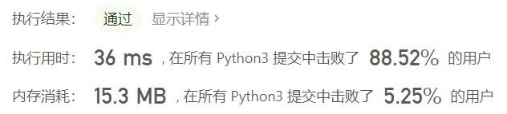
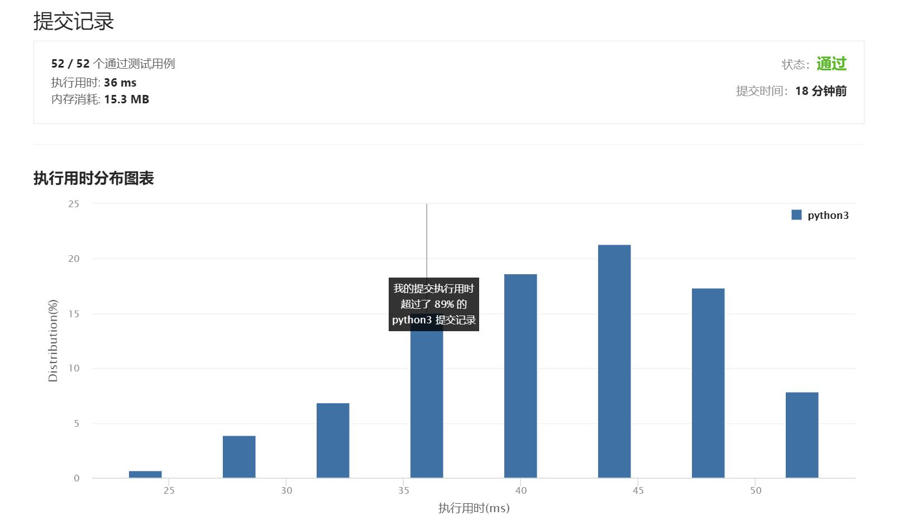

# 1337-矩阵中战斗力最弱的K行

Author：_Mumu

创建日期：2021/8/1

通过日期：2021/8/1

*****

踩过的坑：

1. 第一反应是矩阵乘法来算行和，然后利用python对元组排序的特性来解决问题
2. 但是一个问题是引入`numpy`后会导致结果的格式上有些问题，需要额外处理，而用元组排序的特性则需要大量额外空间来存储数据，所以一直在思考如何将行和与索引结合起来的方式，没有想到
3. 看到一个大佬写的，利用行列数不超过100的性质，将行和乘1000再加上索引，直接进行排序，再对排序结果取模1000即可
4. 而在统计战斗力上，使用二分查找，理论上快于直接求和
5. 大佬牛逼
6. 不过结果最后通过一看，最快的居然还是直接求和加列表排序（与元组排序相同）的算法

已解决：58/2180

*****

难度：简单

问题描述：

给你一个大小为 m * n 的矩阵 mat，矩阵由若干军人和平民组成，分别用 1 和 0 表示。

请你返回矩阵中战斗力最弱的 k 行的索引，按从最弱到最强排序。

如果第 i 行的军人数量少于第 j 行，或者两行军人数量相同但 i 小于 j，那么我们认为第 i 行的战斗力比第 j 行弱。

军人 总是 排在一行中的靠前位置，也就是说 1 总是出现在 0 之前。

 

示例 1：

输入：mat = 
[[1,1,0,0,0],
 [1,1,1,1,0],
 [1,0,0,0,0],
 [1,1,0,0,0],
 [1,1,1,1,1]], 
k = 3
输出：[2,0,3]
解释：
每行中的军人数目：
行 0 -> 2 
行 1 -> 4 
行 2 -> 1 
行 3 -> 2 
行 4 -> 5 
从最弱到最强对这些行排序后得到 [2,0,3,1,4]
示例 2：

输入：mat = 
[[1,0,0,0],
 [1,1,1,1],
 [1,0,0,0],
 [1,0,0,0]], 
k = 2
输出：[0,2]
解释： 
每行中的军人数目：
行 0 -> 1 
行 1 -> 4 
行 2 -> 1 
行 3 -> 1 
从最弱到最强对这些行排序后得到 [0,2,3,1]

提示：

m == mat.length
n == mat[i].length
2 <= n, m <= 100
1 <= k <= m
matrix[i][j] 不是 0 就是 1

来源：力扣（LeetCode）
链接：https://leetcode-cn.com/problems/the-k-weakest-rows-in-a-matrix