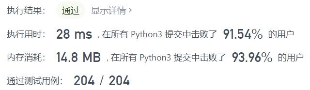
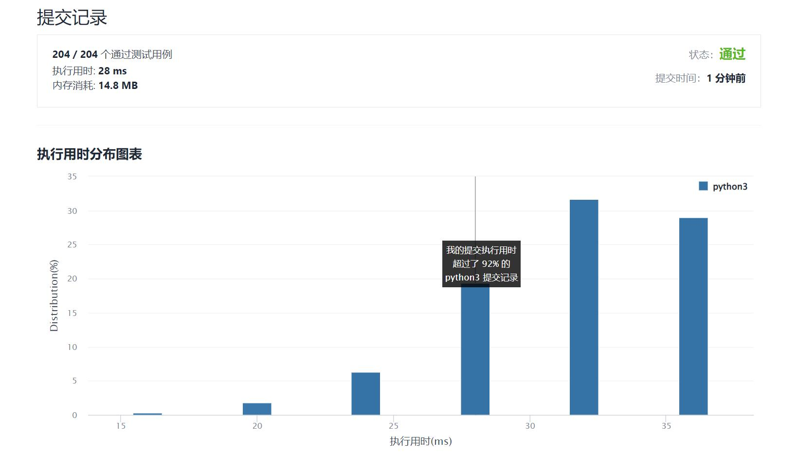

# 1342-将数字变成0的操作次数

Author：_Mumu

创建日期：2022/01/31

通过日期：2022/01/31

*****

踩过的坑：

1. 轻松愉快
2. 换成二进制来看，偶数时末位0除以二即删去这个0，奇数时末位1减1即把1变成0，最终把二进制数变成只剩一个0，操作次数就是二进制中1的个数的两倍减1加0的个数，也就是二进制数长度加1的个数减1
3. 旧年好呀！

已解决：238/2512

*****

难度：简单

问题描述：

给你一个非负整数 num ，请你返回将它变成 0 所需要的步数。 如果当前数字是偶数，你需要把它除以 2 ；否则，减去 1 。

 

示例 1：

输入：num = 14
输出：6
解释：
步骤 1) 14 是偶数，除以 2 得到 7 。
步骤 2） 7 是奇数，减 1 得到 6 。
步骤 3） 6 是偶数，除以 2 得到 3 。
步骤 4） 3 是奇数，减 1 得到 2 。
步骤 5） 2 是偶数，除以 2 得到 1 。
步骤 6） 1 是奇数，减 1 得到 0 。
示例 2：

输入：num = 8
输出：4
解释：
步骤 1） 8 是偶数，除以 2 得到 4 。
步骤 2） 4 是偶数，除以 2 得到 2 。
步骤 3） 2 是偶数，除以 2 得到 1 。
步骤 4） 1 是奇数，减 1 得到 0 。
示例 3：

输入：num = 123
输出：12

提示：

0 <= num <= 10^6

来源：力扣（LeetCode）
链接：https://leetcode-cn.com/problems/number-of-steps-to-reduce-a-number-to-zero
