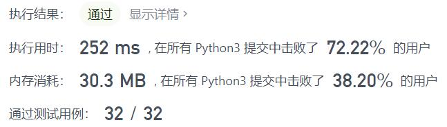
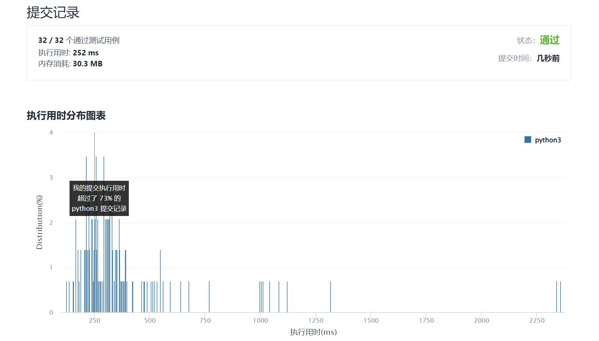

# 1345-跳跃游戏IV

Author：_Mumu

创建日期：2022/01/21

通过日期：2022/01/21

*****

踩过的坑：

1. 简单的广度优先搜索，不过一定要考虑在跳跃后把跳跃键抠掉（同一个数字跳过一次后就不用再跳了），不然在有大量同一个数字的情况下重复计算跳跃会让时间爆掉的
2. 最快的算法写了一堆的集合运算，太漂亮了，学习了！

已解决：214/2498

*****

难度：困难

问题描述：

给你一个整数数组 arr ，你一开始在数组的第一个元素处（下标为 0）。

每一步，你可以从下标 i 跳到下标：

i + 1 满足：i + 1 < arr.length
i - 1 满足：i - 1 >= 0
j 满足：arr[i] == arr[j] 且 i != j
请你返回到达数组最后一个元素的下标处所需的 最少操作次数 。

注意：任何时候你都不能跳到数组外面。

 

示例 1：

输入：arr = [100,-23,-23,404,100,23,23,23,3,404]
输出：3
解释：那你需要跳跃 3 次，下标依次为 0 --> 4 --> 3 --> 9 。下标 9 为数组的最后一个元素的下标。
示例 2：

输入：arr = [7]
输出：0
解释：一开始就在最后一个元素处，所以你不需要跳跃。
示例 3：

输入：arr = [7,6,9,6,9,6,9,7]
输出：1
解释：你可以直接从下标 0 处跳到下标 7 处，也就是数组的最后一个元素处。
示例 4：

输入：arr = [6,1,9]
输出：2
示例 5：

输入：arr = [11,22,7,7,7,7,7,7,7,22,13]
输出：3

提示：

1 <= arr.length <= 5 * 10^4
-10^8 <= arr[i] <= 10^8

来源：力扣（LeetCode）
链接：https://leetcode-cn.com/problems/jump-game-iv
