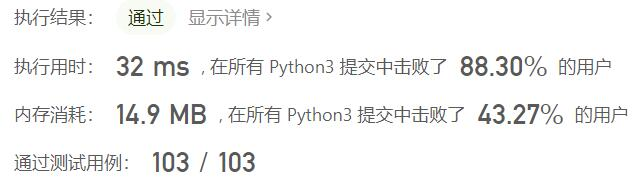
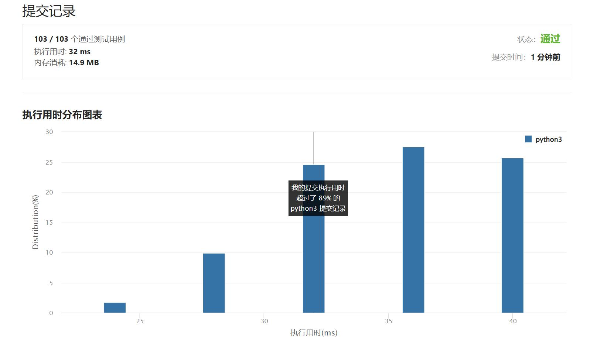

# 1374-生成每种字符都是奇数个的字符串

Author：_Mumu

创建日期：2022/08/01

通过日期：2022/08/01

*****

踩过的坑：

1. 轻松愉快

已解决：418/2726

*****

难度：简单

问题描述：

给你一个整数 n，请你返回一个含 n 个字符的字符串，其中每种字符在该字符串中都恰好出现 奇数次 。

返回的字符串必须只含小写英文字母。如果存在多个满足题目要求的字符串，则返回其中任意一个即可。

 

示例 1：

输入：n = 4
输出："pppz"
解释："pppz" 是一个满足题目要求的字符串，因为 'p' 出现 3 次，且 'z' 出现 1 次。当然，还有很多其他字符串也满足题目要求，比如："ohhh" 和 "love"。
示例 2：

输入：n = 2
输出："xy"
解释："xy" 是一个满足题目要求的字符串，因为 'x' 和 'y' 各出现 1 次。当然，还有很多其他字符串也满足题目要求，比如："ag" 和 "ur"。
示例 3：

输入：n = 7
输出："holasss"

提示：

1 <= n <= 500

来源：力扣（LeetCode）
链接：https://leetcode.cn/problems/generate-a-string-with-characters-that-have-odd-counts