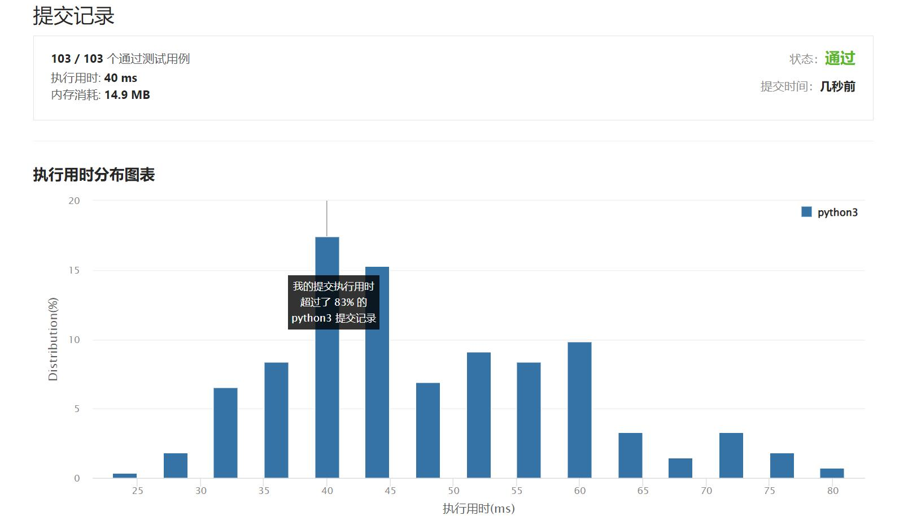

# 1403-非递增顺序的最小子序列

Author：_Mumu

创建日期：2022/08/04

通过日期：2022/08/04

*****

踩过的坑：

1. 轻松愉快
1. 从大到小

已解决：421/2727

*****

难度：简单

问题描述：

给你一个数组 nums，请你从中抽取一个子序列，满足该子序列的元素之和 严格 大于未包含在该子序列中的各元素之和。

如果存在多个解决方案，只需返回 长度最小 的子序列。如果仍然有多个解决方案，则返回 元素之和最大 的子序列。

与子数组不同的地方在于，「数组的子序列」不强调元素在原数组中的连续性，也就是说，它可以通过从数组中分离一些（也可能不分离）元素得到。

注意，题目数据保证满足所有约束条件的解决方案是 唯一 的。同时，返回的答案应当按 非递增顺序 排列。

 

示例 1：

输入：nums = [4,3,10,9,8]
输出：[10,9] 
解释：子序列 [10,9] 和 [10,8] 是最小的、满足元素之和大于其他各元素之和的子序列。但是 [10,9] 的元素之和最大。 
示例 2：

输入：nums = [4,4,7,6,7]
输出：[7,7,6] 
解释：子序列 [7,7] 的和为 14 ，不严格大于剩下的其他元素之和（14 = 4 + 4 + 6）。因此，[7,6,7] 是满足题意的最小子序列。注意，元素按非递增顺序返回。  
示例 3：

输入：nums = [6]
输出：[6]

提示：

1 <= nums.length <= 500
1 <= nums[i] <= 100

来源：力扣（LeetCode）
链接：https://leetcode.cn/problems/minimum-subsequence-in-non-increasing-order