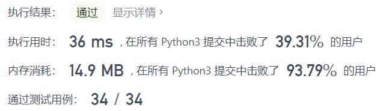
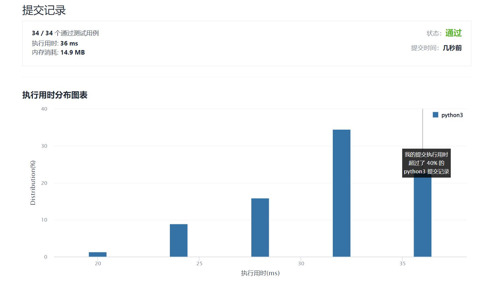

# 1405-最长快乐字符串

Author：_Mumu

创建日期：2022/02/07

通过日期：2022/02/07

*****

踩过的坑：

1. 害行，贪心

已解决：245/2522

*****

难度：中等

问题描述：

如果字符串中不含有任何 'aaa'，'bbb' 或 'ccc' 这样的字符串作为子串，那么该字符串就是一个「快乐字符串」。

给你三个整数 a，b ，c，请你返回 任意一个 满足下列全部条件的字符串 s：

s 是一个尽可能长的快乐字符串。
s 中 最多 有a 个字母 'a'、b 个字母 'b'、c 个字母 'c' 。
s 中只含有 'a'、'b' 、'c' 三种字母。
如果不存在这样的字符串 s ，请返回一个空字符串 ""。

 

示例 1：

输入：a = 1, b = 1, c = 7
输出："ccaccbcc"
解释："ccbccacc" 也是一种正确答案。
示例 2：

输入：a = 2, b = 2, c = 1
输出："aabbc"
示例 3：

输入：a = 7, b = 1, c = 0
输出："aabaa"
解释：这是该测试用例的唯一正确答案。

提示：

0 <= a, b, c <= 100
a + b + c > 0

来源：力扣（LeetCode）
链接：https://leetcode-cn.com/problems/longest-happy-string
