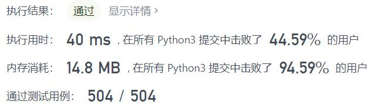
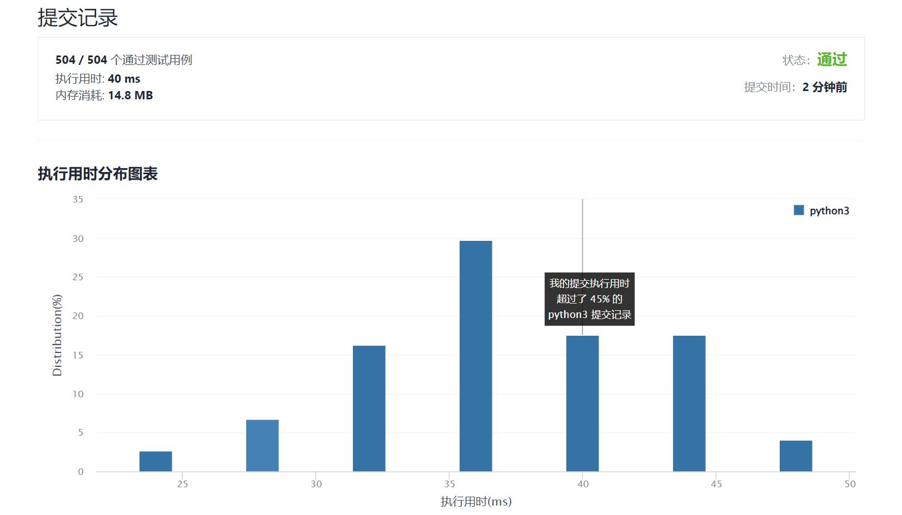

# 1414-和为K的最少斐波那契数字数目

Author：_Mumu

创建日期：2022/02/03

通过日期：2022/02/03

*****

踩过的坑：

1. 轻松愉快
4. 新年好呀！

已解决：241/2513

*****

难度：中等

问题描述：

给你数字 k ，请你返回和为 k 的斐波那契数字的最少数目，其中，每个斐波那契数字都可以被使用多次。

斐波那契数字定义为：

F1 = 1
F2 = 1
Fn = Fn-1 + Fn-2 ， 其中 n > 2 。
数据保证对于给定的 k ，一定能找到可行解。

 

示例 1：

输入：k = 7
输出：2 
解释：斐波那契数字为：1，1，2，3，5，8，13，……
对于 k = 7 ，我们可以得到 2 + 5 = 7 。
示例 2：

输入：k = 10
输出：2 
解释：对于 k = 10 ，我们可以得到 2 + 8 = 10 。
示例 3：

输入：k = 19
输出：3 
解释：对于 k = 19 ，我们可以得到 1 + 5 + 13 = 19 。

提示：

1 <= k <= 10^9

来源：力扣（LeetCode）
链接：https://leetcode-cn.com/problems/find-the-minimum-number-of-fibonacci-numbers-whose-sum-is-k
