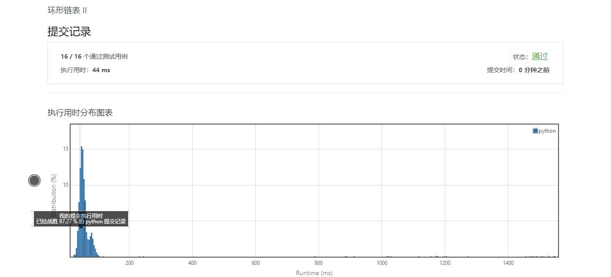

# 142-环形链表II

Author：_Mumu

创建日期：2019/10/3

通过日期：2019/10/3

*****

踩过的坑：

1. 题目与141的区别在于不允许修改链表的值，并且如果有环则输出开始入环的第一个节点
2. 遍历并存储所有列表节点的算法不难写，但是耗时也耗空间
3. 判断是否有环可直接用141的算法，可设列表入环前有n个节点，列表的环有m个节点，step和run分别走了k和2k步后相遇。则二者走过的节点数差值为环长度的正整数倍，即k=2k-k=qm，q为正整数。并且相遇时二者所在位置为环的第qm-n个节点。再假设有两个元素p1和p2，分别从列表头与相遇节点以步长为1开始行走。走过步数小于等于n时p1未入环，p2在环内，2者不可能相遇。走过步数恰为n+1时，p1刚好入环，p2位于环的第qm+1个节点，亦为入环位置，二者相遇。并且这个相遇点就是列表的入环点
4. 5555555，看了官方解答才知道能用这样的算法写，tnbl

已解决：3/1189

*****

难度：中等

问题描述：

给定一个链表，返回链表开始入环的第一个节点。 如果链表无环，则返回 null。

为了表示给定链表中的环，我们使用整数 pos 来表示链表尾连接到链表中的位置（索引从 0 开始）。 如果 pos 是 -1，则在该链表中没有环。

说明：不允许修改给定的链表。

示例 1：

输入：head = [3,2,0,-4], pos = 1

输出：tail connects to node index 1

解释：链表中有一个环，其尾部连接到第二个节点。

示例 2：

输入：head = [1,2], pos = 0

输出：tail connects to node index 0

解释：链表中有一个环，其尾部连接到第一个节点。

示例 3：

输入：head = [1], pos = -1

输出：no cycle

解释：链表中没有环。

进阶：

你是否可以不用额外空间解决此题？

来源：力扣（LeetCode）
链接：https://leetcode-cn.com/problems/linked-list-cycle-ii