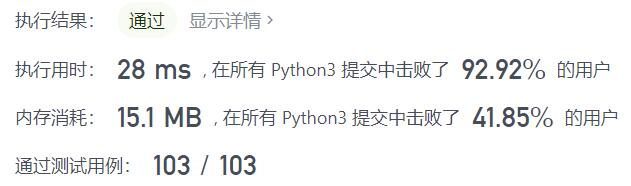
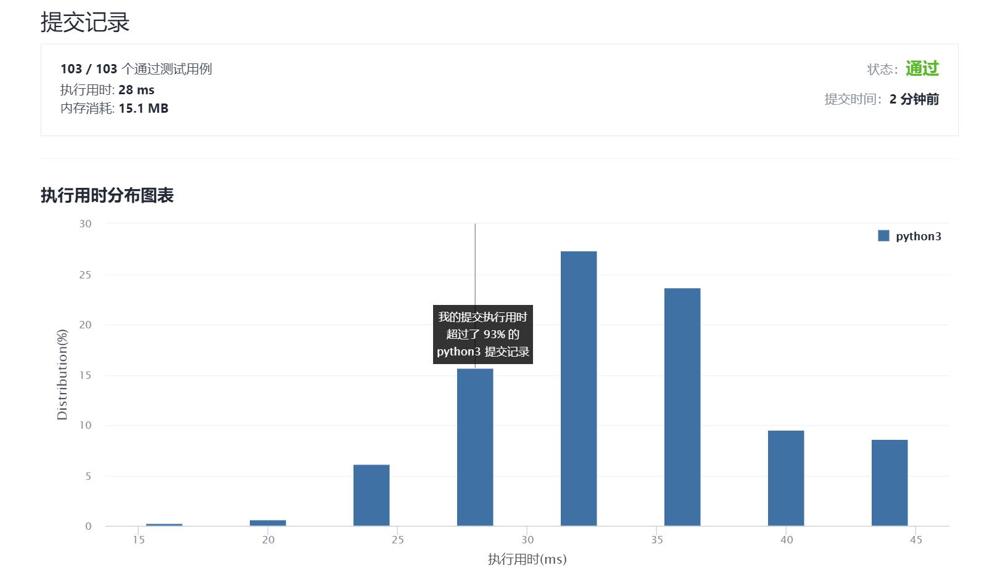

# 1436-旅行终点站

Author：_Mumu

创建日期：2021/10/1

通过日期：2021/10/1

*****

踩过的坑：

1. 好简单，结果看题解好家伙，还是更牛逼
2. 不存储终点站直接使空间复杂度减半，牛啊
3. 而且题解第二行太妙了，让我知道了这样的语句创建的是一个迭代器，在其外部加`[]`即创建列表，也可以像第一行一样加`{}`创建集合，用`next()`则直接访问第一项，学到了，妙啊

已解决：103/2376

*****

难度：简单

问题描述：

给你一份旅游线路图，该线路图中的旅行线路用数组 paths 表示，其中 paths[i] = [cityAi, cityBi] 表示该线路将会从 cityAi 直接前往 cityBi 。请你找出这次旅行的终点站，即没有任何可以通往其他城市的线路的城市。

题目数据保证线路图会形成一条不存在循环的线路，因此恰有一个旅行终点站。

 

示例 1：

输入：paths = [["London","New York"],["New York","Lima"],["Lima","Sao Paulo"]]
输出："Sao Paulo" 
解释：从 "London" 出发，最后抵达终点站 "Sao Paulo" 。本次旅行的路线是 "London" -> "New York" -> "Lima" -> "Sao Paulo" 。
示例 2：

输入：paths = [["B","C"],["D","B"],["C","A"]]
输出："A"
解释：所有可能的线路是：
"D" -> "B" -> "C" -> "A". 
"B" -> "C" -> "A". 
"C" -> "A". 
"A". 
显然，旅行终点站是 "A" 。
示例 3：

输入：paths = [["A","Z"]]
输出："Z"

提示：

1 <= paths.length <= 100
paths[i].length == 2
1 <= cityAi.length, cityBi.length <= 10
cityAi != cityBi
所有字符串均由大小写英文字母和空格字符组成。

来源：力扣（LeetCode）
链接：https://leetcode-cn.com/problems/destination-city
