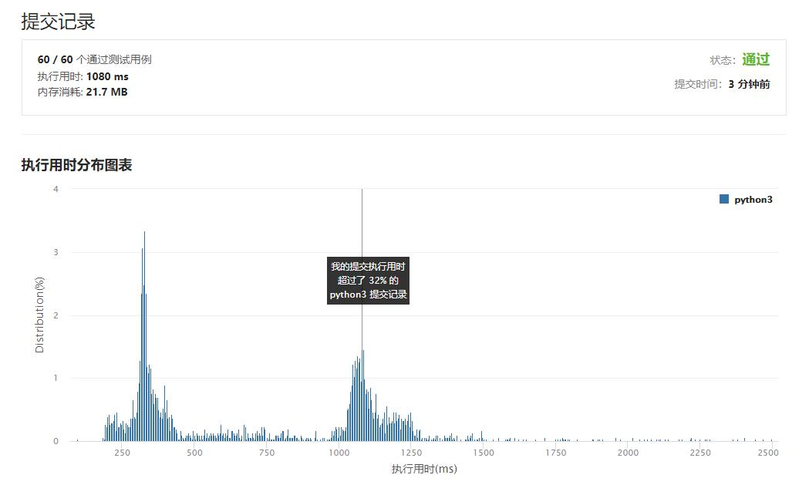

# 1438-绝对差不超过限制的最长连续子数组

Author：_Mumu

创建日期：2021/2/22

通过日期：2021/2/23

*****

踩过的坑：

1. 哇，要是没看解答真不知道怎么做/(ㄒoㄒ)/~~
2. 看了解答之后也不知道怎么做（不是），第一次看了答案只用滑动窗口自己写了个，轻轻松松超过时间限制，根本上讲应该是最大值和最小值这一块用时太长
3. 再看了解答知道可以用SortedList来做
4. 再看了解答可以用deque轻松得到最大最小值
5. 太牛了( ఠൠఠ )ﾉ

已解决：13/1982

*****

难度：中等

问题描述：

给你一个整数数组 nums ，和一个表示限制的整数 limit，请你返回最长连续子数组的长度，该子数组中的任意两个元素之间的绝对差必须小于或者等于 limit 。

如果不存在满足条件的子数组，则返回 0 。

示例 1：

输入：nums = [8,2,4,7], limit = 4
输出：2 
解释：所有子数组如下：
[8] 最大绝对差 |8-8| = 0 <= 4.
[8,2] 最大绝对差 |8-2| = 6 > 4. 
[8,2,4] 最大绝对差 |8-2| = 6 > 4.
[8,2,4,7] 最大绝对差 |8-2| = 6 > 4.
[2] 最大绝对差 |2-2| = 0 <= 4.
[2,4] 最大绝对差 |2-4| = 2 <= 4.
[2,4,7] 最大绝对差 |2-7| = 5 > 4.
[4] 最大绝对差 |4-4| = 0 <= 4.
[4,7] 最大绝对差 |4-7| = 3 <= 4.
[7] 最大绝对差 |7-7| = 0 <= 4. 
因此，满足题意的最长子数组的长度为 2 。
示例 2：

输入：nums = [10,1,2,4,7,2], limit = 5
输出：4 
解释：满足题意的最长子数组是 [2,4,7,2]，其最大绝对差 |2-7| = 5 <= 5 。
示例 3：

输入：nums = [4,2,2,2,4,4,2,2], limit = 0
输出：3

提示：

1 <= nums.length <= 10^5
1 <= nums[i] <= 10^9
0 <= limit <= 10^9

来源：力扣（LeetCode）
链接：https://leetcode-cn.com/problems/longest-continuous-subarray-with-absolute-diff-less-than-or-equal-to-limit