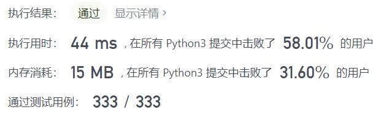
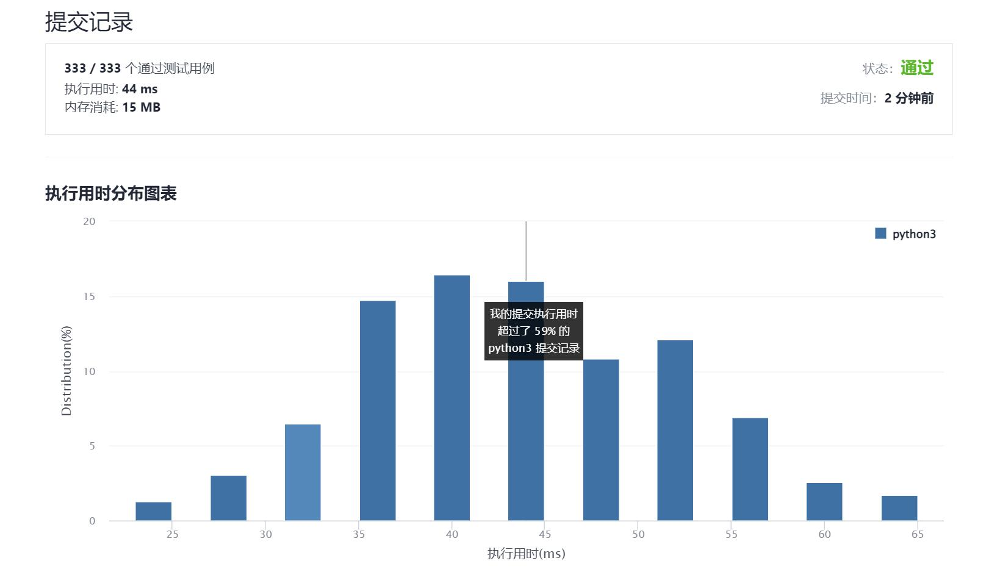

# 1446-连续字符

Author：_Mumu

创建日期：2021/12/01

通过日期：2021/12/01

*****

踩过的坑：

1. 轻松愉快！
2. 十二月快乐！

已解决：163/2447

*****

难度：简单

问题描述：

给你一个字符串 s ，字符串的「能量」定义为：只包含一种字符的最长非空子字符串的长度。

请你返回字符串的能量。

 

示例 1：

输入：s = "leetcode"
输出：2
解释：子字符串 "ee" 长度为 2 ，只包含字符 'e' 。
示例 2：

输入：s = "abbcccddddeeeeedcba"
输出：5
解释：子字符串 "eeeee" 长度为 5 ，只包含字符 'e' 。
示例 3：

输入：s = "triplepillooooow"
输出：5
示例 4：

输入：s = "hooraaaaaaaaaaay"
输出：11
示例 5：

输入：s = "tourist"
输出：1

提示：

1 <= s.length <= 500
s 只包含小写英文字母。

来源：力扣（LeetCode）
链接：https://leetcode-cn.com/problems/consecutive-characters
