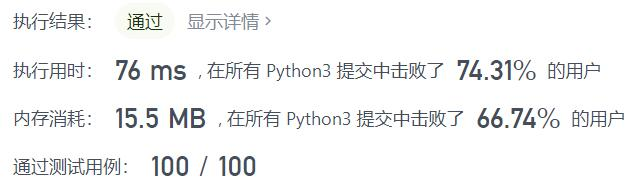
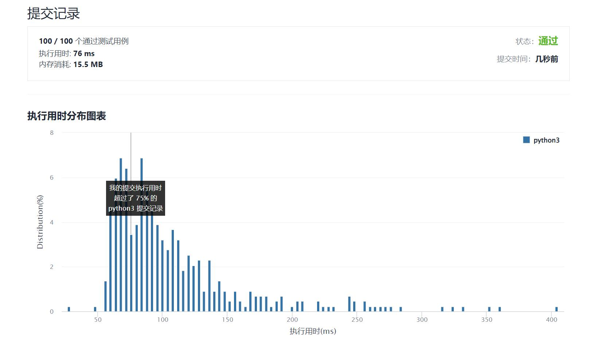

# 1447-最简分数

Author：_Mumu

创建日期：2022/02/11

通过日期：2022/02/11

*****

踩过的坑：

1. 唯一的难度在于如何快速判断两数互质
2. 我使用`rela = defaultdict(set)`，`rela[i]`为数$i$所含的所有质因数，那么若`rela[i] & rela[j]`为空，则两数互质
3. 为获得表`rela`，从$i=2$开始遍历数$i$至$i=n$，若`rela[i]`为空，则说明$i$为质数，那么为所有$i$的倍数$j\leq n$，执行`rela[j].add(i)`即可
4. 然后使用双循环遍历即可得到所有分数
5. 一顿操作猛如虎
6. 一看题解，直接`math.gcd(i, j)`

已解决：248/2523

*****

难度：中等

问题描述：

给你一个整数 n ，请你返回所有 0 到 1 之间（不包括 0 和 1）满足分母小于等于  n 的 最简 分数 。分数可以以 任意 顺序返回。

 

示例 1：

输入：n = 2
输出：["1/2"]
解释："1/2" 是唯一一个分母小于等于 2 的最简分数。
示例 2：

输入：n = 3
输出：["1/2","1/3","2/3"]
示例 3：

输入：n = 4
输出：["1/2","1/3","1/4","2/3","3/4"]
解释："2/4" 不是最简分数，因为它可以化简为 "1/2" 。
示例 4：

输入：n = 1
输出：[]

提示：

1 <= n <= 100

来源：力扣（LeetCode）
链接：https://leetcode-cn.com/problems/simplified-fractions
