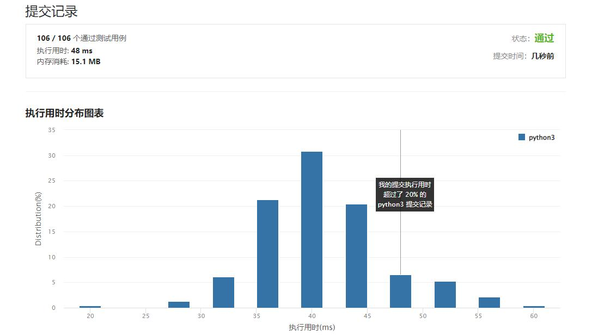

# 1460-通过翻转子数组使两个数组相等

Author：_Mumu

创建日期：2022/08/24

通过日期：2022/08/24

*****

踩过的坑：

1. 轻松愉快
2. Counter，结束

已解决：441/2752

*****

难度：简单

问题描述：

给你两个长度相同的整数数组 target 和 arr 。每一步中，你可以选择 arr 的任意 非空子数组 并将它翻转。你可以执行此过程任意次。

如果你能让 arr 变得与 target 相同，返回 True；否则，返回 False 。

 

示例 1：

输入：target = [1,2,3,4], arr = [2,4,1,3]
输出：true
解释：你可以按照如下步骤使 arr 变成 target：
1- 翻转子数组 [2,4,1] ，arr 变成 [1,4,2,3]
2- 翻转子数组 [4,2] ，arr 变成 [1,2,4,3]
3- 翻转子数组 [4,3] ，arr 变成 [1,2,3,4]
上述方法并不是唯一的，还存在多种将 arr 变成 target 的方法。
示例 2：

输入：target = [7], arr = [7]
输出：true
解释：arr 不需要做任何翻转已经与 target 相等。
示例 3：

输入：target = [3,7,9], arr = [3,7,11]
输出：false
解释：arr 没有数字 9 ，所以无论如何也无法变成 target 。

提示：

target.length == arr.length
1 <= target.length <= 1000
1 <= target[i] <= 1000
1 <= arr[i] <= 1000

来源：力扣（LeetCode）
链接：https://leetcode.cn/problems/make-two-arrays-equal-by-reversing-sub-arrays