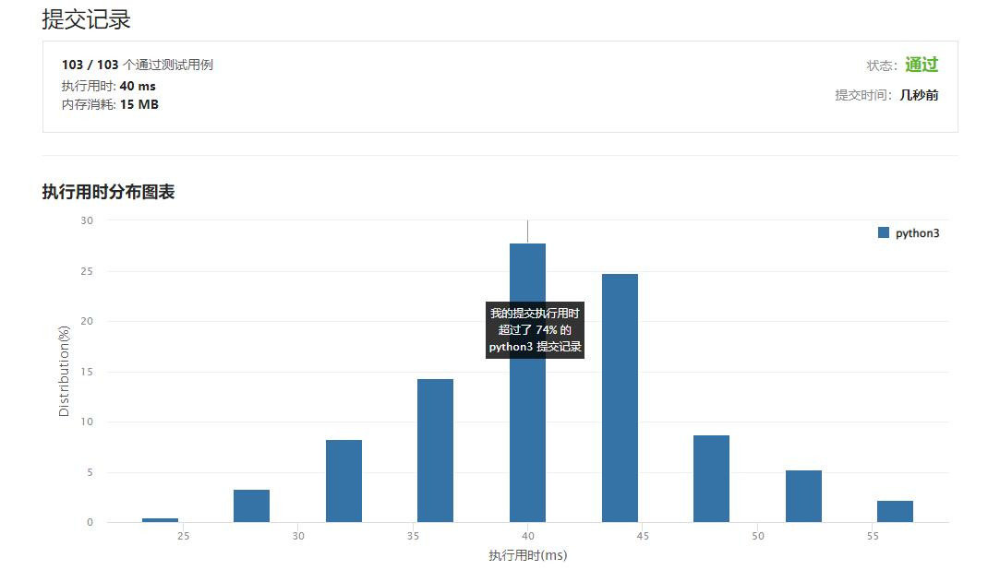

# 1475-商品折扣后的最终价格

Author：_Mumu

创建日期：2022/09/01

通过日期：2022/09/01

*****

踩过的坑：

1. 轻松愉快
2. 单调栈牛逼

已解决：449/2759

*****

难度：简单

问题描述：

给你一个数组 prices ，其中 prices[i] 是商店里第 i 件商品的价格。

商店里正在进行促销活动，如果你要买第 i 件商品，那么你可以得到与 prices[j] 相等的折扣，其中 j 是满足 j > i 且 prices[j] <= prices[i] 的 最小下标 ，如果没有满足条件的 j ，你将没有任何折扣。

请你返回一个数组，数组中第 i 个元素是折扣后你购买商品 i 最终需要支付的价格。

 

示例 1：

输入：prices = [8,4,6,2,3]
输出：[4,2,4,2,3]
解释：
商品 0 的价格为 price[0]=8 ，你将得到 prices[1]=4 的折扣，所以最终价格为 8 - 4 = 4 。
商品 1 的价格为 price[1]=4 ，你将得到 prices[3]=2 的折扣，所以最终价格为 4 - 2 = 2 。
商品 2 的价格为 price[2]=6 ，你将得到 prices[3]=2 的折扣，所以最终价格为 6 - 2 = 4 。
商品 3 和 4 都没有折扣。
示例 2：

输入：prices = [1,2,3,4,5]
输出：[1,2,3,4,5]
解释：在这个例子中，所有商品都没有折扣。
示例 3：

输入：prices = [10,1,1,6]
输出：[9,0,1,6]

提示：

1 <= prices.length <= 500
1 <= prices[i] <= 10^3

来源：力扣（LeetCode）
链接：https://leetcode.cn/problems/final-prices-with-a-special-discount-in-a-shop