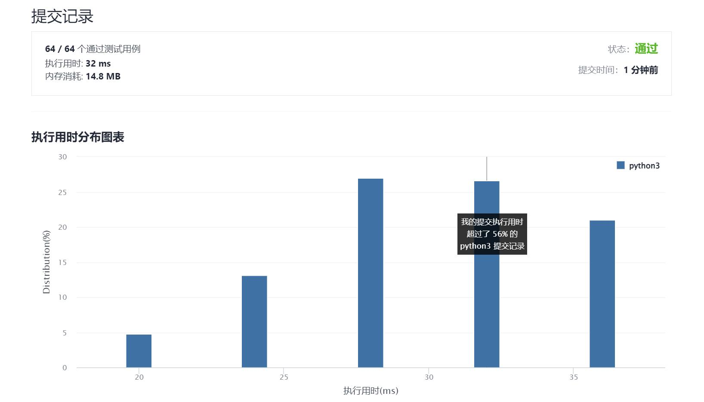

# 1518-换酒问题

Author：_Mumu

创建日期：2021/12/17

通过日期：2021/12/17

*****

踩过的坑：

1. 轻松愉快！
2. 开心呢！！

已解决：179/2462

*****

难度：简单

问题描述：

小区便利店正在促销，用 numExchange 个空酒瓶可以兑换一瓶新酒。你购入了 numBottles 瓶酒。

如果喝掉了酒瓶中的酒，那么酒瓶就会变成空的。

请你计算 最多 能喝到多少瓶酒。

 

示例 1：

输入：numBottles = 9, numExchange = 3
输出：13
解释：你可以用 3 个空酒瓶兑换 1 瓶酒。
所以最多能喝到 9 + 3 + 1 = 13 瓶酒。
示例 2：

输入：numBottles = 15, numExchange = 4
输出：19
解释：你可以用 4 个空酒瓶兑换 1 瓶酒。
所以最多能喝到 15 + 3 + 1 = 19 瓶酒。
示例 3：

输入：numBottles = 5, numExchange = 5
输出：6
示例 4：

输入：numBottles = 2, numExchange = 3
输出：2

提示：

1 <= numBottles <= 100
2 <= numExchange <= 100

来源：力扣（LeetCode）
链接：https://leetcode-cn.com/problems/water-bottles
