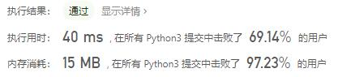
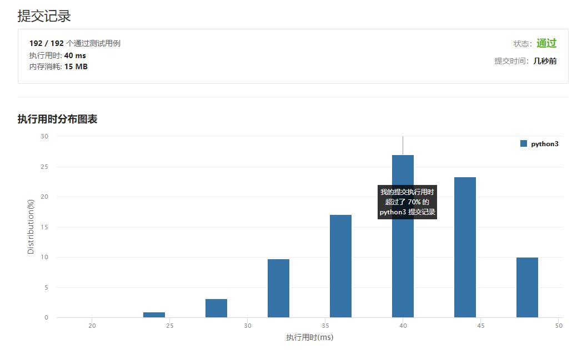

# 154-寻找旋转排序数组中的最小值II

Author：_Mumu

创建日期：2021/4/9

通过日期：2021/4/9

!

*****

踩过的坑：

1. 执行错误一次，解答错误四次，可见坑之多
2. 一开始是打算仿照153来写，认为只需要像81一样处理nums[left]、nums[mid]、nums[right]三者相等的情况即可，但是实际上并不是这样的
3. 首先153的写法可行是因为在循环中默认了nums[left]大于nums[right]，但是154可能出现两者相等的情况，而像81这样处理三者相等情况时，可能导致nums[left]小于nums[right]的情况出现，从而让整个循环内的逻辑失效
4. 所以直接在153的逻辑内加入处理三者相同的情况时，判断nums[left+1]和nums[left]以及nums[right-1]和nums[right]的大小关系：如果nums[left+1]小于nums[left]则可以直接返回nums[left+1]，否则更新left=left+1；如果nums[right-1]大于nums[right]则可以直接返回nums[right]，否则更新right=right-1
5. 另外还有一个小错误点，列表长度是奇数并且各个元素相同，那么right=left+1的终止条件会直接失效，因此应另外添加一个终止条件right=left
6. 不愧是困难题，不过思路不难，应该算是比较容易的困难题了吧，不到半小时就做出来真开心o(*￣▽￣*)ブ

已解决：19/2036

*****

难度：困难

问题描述：

已知一个长度为 n 的数组，预先按照升序排列，经由 1 到 n 次 旋转 后，得到输入数组。例如，原数组 nums = [0,1,4,4,5,6,7] 在变化后可能得到：
若旋转 4 次，则可以得到 [4,5,6,7,0,1,4]
若旋转 7 次，则可以得到 [0,1,4,4,5,6,7]
注意，数组 [a[0], a[1], a[2], ..., a[n-1]] 旋转一次 的结果为数组 [a[n-1], a[0], a[1], a[2], ..., a[n-2]] 。

给你一个可能存在 重复 元素值的数组 nums ，它原来是一个升序排列的数组，并按上述情形进行了多次旋转。请你找出并返回数组中的 最小元素 。

 

示例 1：

输入：nums = [1,3,5]
输出：1
示例 2：

输入：nums = [2,2,2,0,1]
输出：0

提示：

n == nums.length
1 <= n <= 5000
-5000 <= nums[i] <= 5000
nums 原来是一个升序排序的数组，并进行了 1 至 n 次旋转

来源：力扣（LeetCode）
链接：https://leetcode-cn.com/problems/find-minimum-in-rotated-sorted-array-ii