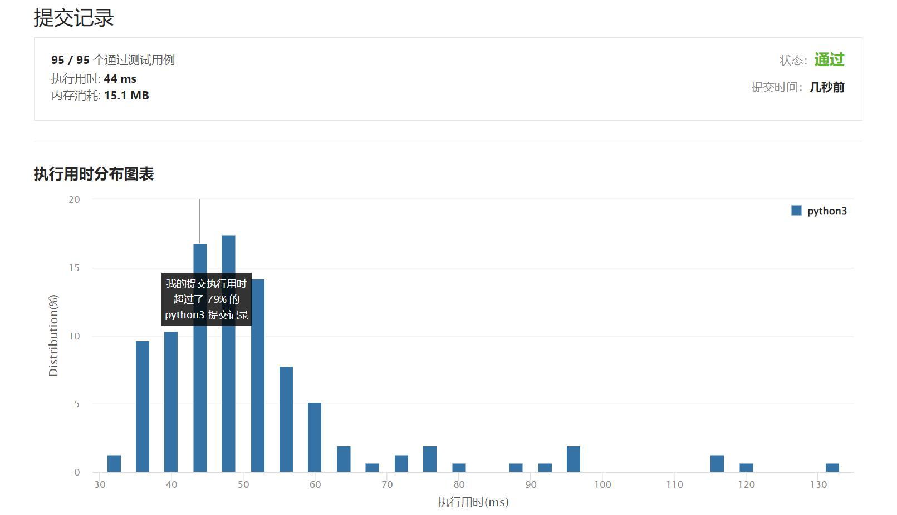

# 1582-二进制矩阵中的特殊位置

Author：_Mumu

创建日期：2022/09/04

通过日期：2022/09/04

*****

踩过的坑：

1. 轻松愉快

已解决：452/2764

*****

难度：简单

问题描述：

给你一个大小为 rows x cols 的矩阵 mat，其中 mat[i][j] 是 0 或 1，请返回 矩阵 mat 中特殊位置的数目 。

特殊位置 定义：如果 mat[i][j] == 1 并且第 i 行和第 j 列中的所有其他元素均为 0（行和列的下标均 从 0 开始 ），则位置 (i, j) 被称为特殊位置。

 

示例 1：

输入：mat = [[1,0,0],
            [0,0,1],
            [1,0,0]]
输出：1
解释：(1,2) 是一个特殊位置，因为 mat[1][2] == 1 且所处的行和列上所有其他元素都是 0
示例 2：

输入：mat = [[1,0,0],
            [0,1,0],
            [0,0,1]]
输出：3
解释：(0,0), (1,1) 和 (2,2) 都是特殊位置
示例 3：

输入：mat = [[0,0,0,1],
            [1,0,0,0],
            [0,1,1,0],
            [0,0,0,0]]
输出：2
示例 4：

输入：mat = [[0,0,0,0,0],
            [1,0,0,0,0],
            [0,1,0,0,0],
            [0,0,1,0,0],
            [0,0,0,1,1]]
输出：3

提示：

rows == mat.length
cols == mat[i].length
1 <= rows, cols <= 100
mat[i][j] 是 0 或 1

来源：力扣（LeetCode）
链接：https://leetcode.cn/problems/special-positions-in-a-binary-matrix