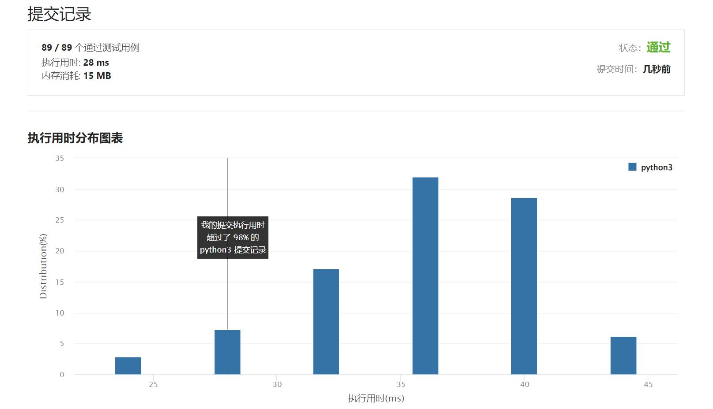

# 1592-重新排列单词间的空格

Author：_Mumu

创建日期：2022/09/07

通过日期：2022/09/07

*****

踩过的坑：

1. 轻松愉快

已解决：455/2768

*****

难度：简单

问题描述：

给你一个字符串 text ，该字符串由若干被空格包围的单词组成。每个单词由一个或者多个小写英文字母组成，并且两个单词之间至少存在一个空格。题目测试用例保证 text 至少包含一个单词 。

请你重新排列空格，使每对相邻单词之间的空格数目都 相等 ，并尽可能 最大化 该数目。如果不能重新平均分配所有空格，请 将多余的空格放置在字符串末尾 ，这也意味着返回的字符串应当与原 text 字符串的长度相等。

返回 重新排列空格后的字符串 。

 

示例 1：

输入：text = "  this   is  a sentence "
输出："this   is   a   sentence"
解释：总共有 9 个空格和 4 个单词。可以将 9 个空格平均分配到相邻单词之间，相邻单词间空格数为：9 / (4-1) = 3 个。
示例 2：

输入：text = " practice   makes   perfect"
输出："practice   makes   perfect "
解释：总共有 7 个空格和 3 个单词。7 / (3-1) = 3 个空格加上 1 个多余的空格。多余的空格需要放在字符串的末尾。
示例 3：

输入：text = "hello   world"
输出："hello   world"
示例 4：

输入：text = "  walks  udp package   into  bar a"
输出："walks  udp  package  into  bar  a "
示例 5：

输入：text = "a"
输出："a"

提示：

1 <= text.length <= 100
text 由小写英文字母和 ' ' 组成
text 中至少包含一个单词

来源：力扣（LeetCode）
链接：https://leetcode.cn/problems/rearrange-spaces-between-words