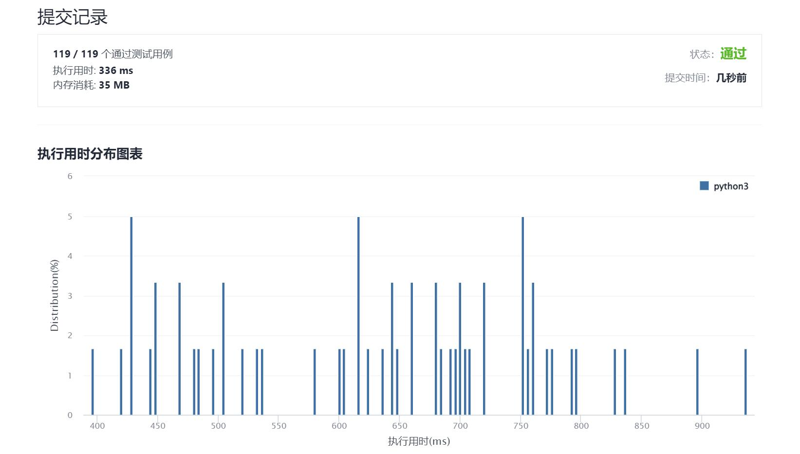

# 1610-可见点的最大数目

Author：_Mumu

创建日期：2021/12/16

通过日期：2021/12/16

*****

踩过的坑：

1. 草了
2. 想岔了，一开始还想着用斜率，结果过于繁琐写了半天还写不对，哭了
3. 一看题解直接变极角，舒服多了绝了
4. 以所处位置`location`为原点，其余点转换为关于原点在极坐标中的极角并加入列表`polar_degrees`，排列列表
5. 考虑到视野跨越极轴的情况，在`polar_degrees`后加上一个所有`polar_degrees`的元素外加$2\pi$的列表，后可在该列表中求解视野范围，可用二分法或滑动窗口，滑动窗口相比二分法更快
6. 注意：角度转弧度公式：$\alpha = \frac{a}{180}\times\pi$
7. 注意：滑动窗口时，左端点下标不小于`polar_degrees`原本的长度时应停止；左端点每一步不应只简单地右移一位，而是右移数位直到窗口符合条件；可以在每一次更新答案时检查答案是否是`points`的长度，如果是可直接返回，以节省时间（因为这是答案可能取的最大值）
8. 大概是比大家多用了上面这些提速方法，所以舒适地100%了

已解决：178/2462

*****

难度：困难

问题描述：

给你一个点数组 points 和一个表示角度的整数 angle ，你的位置是 location ，其中 location = [posx, posy] 且 points[i] = [xi, yi] 都表示 X-Y 平面上的整数坐标。

最开始，你面向东方进行观测。你 不能 进行移动改变位置，但可以通过 自转 调整观测角度。换句话说，posx 和 posy 不能改变。你的视野范围的角度用 angle 表示， 这决定了你观测任意方向时可以多宽。设 d 为你逆时针自转旋转的度数，那么你的视野就是角度范围 [d - angle/2, d + angle/2] 所指示的那片区域。

对于每个点，如果由该点、你的位置以及从你的位置直接向东的方向形成的角度 位于你的视野中 ，那么你就可以看到它。

同一个坐标上可以有多个点。你所在的位置也可能存在一些点，但不管你的怎么旋转，总是可以看到这些点。同时，点不会阻碍你看到其他点。

返回你能看到的点的最大数目。

 

示例 1：

输入：points = [[2,1],[2,2],[3,3]], angle = 90, location = [1,1]
输出：3
解释：阴影区域代表你的视野。在你的视野中，所有的点都清晰可见，尽管 [2,2] 和 [3,3]在同一条直线上，你仍然可以看到 [3,3] 。
示例 2：

输入：points = [[2,1],[2,2],[3,4],[1,1]], angle = 90, location = [1,1]
输出：4
解释：在你的视野中，所有的点都清晰可见，包括你所在位置的那个点。
示例 3：

输入：points = [[1,0],[2,1]], angle = 13, location = [1,1]
输出：1
解释：如图所示，你只能看到两点之一。

提示：

1 <= points.length <= 105
points[i].length == 2
location.length == 2
0 <= angle < 360
0 <= posx, posy, xi, yi <= 100

来源：力扣（LeetCode）
链接：https://leetcode-cn.com/problems/maximum-number-of-visible-points
