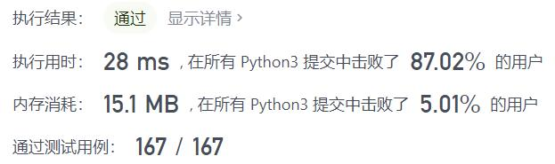
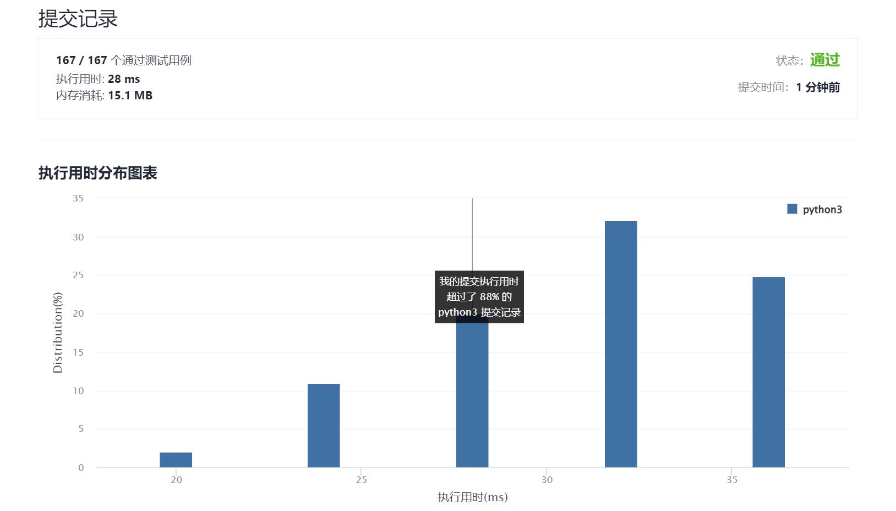

# 1614-括号的最大嵌套深度

Author：_Mumu

创建日期：2022/01/07

通过日期：2022/01/07

*****

踩过的坑：

1. 轻松愉快
2. 更没啥好说的了，看到括号嵌套还在想这尼玛也是简单？结果一看题就只要统计就好了，那还确实是简单

已解决：200/2483

*****

难度：简单

问题描述：

如果字符串满足以下条件之一，则可以称之为 有效括号字符串（valid parentheses string，可以简写为 VPS）：

字符串是一个空字符串 ""，或者是一个不为 "(" 或 ")" 的单字符。
字符串可以写为 AB（A 与 B 字符串连接），其中 A 和 B 都是 有效括号字符串 。
字符串可以写为 (A)，其中 A 是一个 有效括号字符串 。
类似地，可以定义任何有效括号字符串 S 的 嵌套深度 depth(S)：

depth("") = 0
depth(C) = 0，其中 C 是单个字符的字符串，且该字符不是 "(" 或者 ")"
depth(A + B) = max(depth(A), depth(B))，其中 A 和 B 都是 有效括号字符串
depth("(" + A + ")") = 1 + depth(A)，其中 A 是一个 有效括号字符串
例如：""、"()()"、"()(()())" 都是 有效括号字符串（嵌套深度分别为 0、1、2），而 ")(" 、"(()" 都不是 有效括号字符串 。

给你一个 有效括号字符串 s，返回该字符串的 s 嵌套深度 。

 

示例 1：

输入：s = "(1+(2*3)+((8)/4))+1"
输出：3
解释：数字 8 在嵌套的 3 层括号中。
示例 2：

输入：s = "(1)+((2))+(((3)))"
输出：3
示例 3：

输入：s = "1+(2*3)/(2-1)"
输出：1
示例 4：

输入：s = "1"
输出：0

提示：

1 <= s.length <= 100
s 由数字 0-9 和字符 '+'、'-'、'*'、'/'、'('、')' 组成
题目数据保证括号表达式 s 是 有效的括号表达式

来源：力扣（LeetCode）
链接：https://leetcode-cn.com/problems/maximum-nesting-depth-of-the-parentheses
