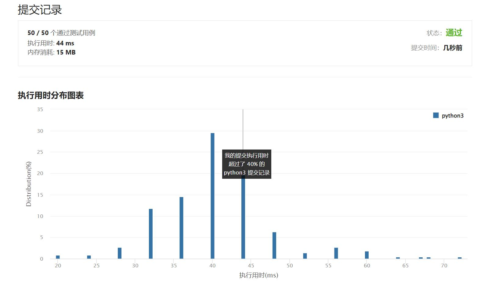

# 1619-删除某些元素后的数组均值

Author：_Mumu

创建日期：2022/09/14

通过日期：2022/09/14

*****

踩过的坑：

1. 轻松愉快

已解决：462/2773

*****

难度：简单

问题描述：

给你一个整数数组 arr ，请你删除最小 5% 的数字和最大 5% 的数字后，剩余数字的平均值。

与 标准答案 误差在 10-5 的结果都被视为正确结果。

 

示例 1：

输入：arr = [1,2,2,2,2,2,2,2,2,2,2,2,2,2,2,2,2,2,2,3]
输出：2.00000
解释：删除数组中最大和最小的元素后，所有元素都等于 2，所以平均值为 2 。
示例 2：

输入：arr = [6,2,7,5,1,2,0,3,10,2,5,0,5,5,0,8,7,6,8,0]
输出：4.00000
示例 3：

输入：arr = [6,0,7,0,7,5,7,8,3,4,0,7,8,1,6,8,1,1,2,4,8,1,9,5,4,3,8,5,10,8,6,6,1,0,6,10,8,2,3,4]
输出：4.77778
示例 4：

输入：arr = [9,7,8,7,7,8,4,4,6,8,8,7,6,8,8,9,2,6,0,0,1,10,8,6,3,3,5,1,10,9,0,7,10,0,10,4,1,10,6,9,3,6,0,0,2,7,0,6,7,2,9,7,7,3,0,1,6,1,10,3]
输出：5.27778
示例 5：

输入：arr = [4,8,4,10,0,7,1,3,7,8,8,3,4,1,6,2,1,1,8,0,9,8,0,3,9,10,3,10,1,10,7,3,2,1,4,9,10,7,6,4,0,8,5,1,2,1,6,2,5,0,7,10,9,10,3,7,10,5,8,5,7,6,7,6,10,9,5,10,5,5,7,2,10,7,7,8,2,0,1,1]
输出：5.29167

提示：

20 <= arr.length <= 1000
arr.length 是 20 的 倍数 
0 <= arr[i] <= 105

来源：力扣（LeetCode）
链接：https://leetcode.cn/problems/mean-of-array-after-removing-some-elements