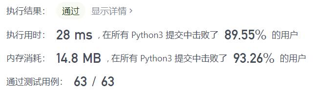
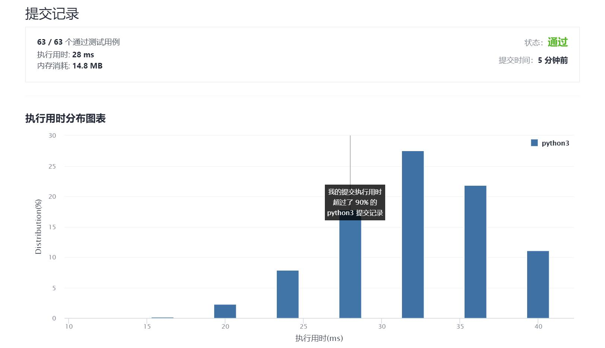

# 162-寻找峰值

Author：_Mumu

创建日期：2021/9/15

通过日期：2021/9/15

*****

踩过的坑：

1. 知道应该二分的，但是总想着比较中间和左右端点的值，忘记了应该做的是判断中间是否是峰还是递增或递减
2. 看了题解后很快就写完了
3. 注意：虽然不判断中间是不是峰也能达到要求，但是加入判断后可以跳过许多无效计算，加快运行速度

已解决：90/2353

*****

难度：中等

问题描述：

峰值元素是指其值严格大于左右相邻值的元素。

给你一个整数数组 nums，找到峰值元素并返回其索引。数组可能包含多个峰值，在这种情况下，返回 任何一个峰值 所在位置即可。

你可以假设 nums[-1] = nums[n] = -∞ 。

你必须实现时间复杂度为 O(log n) 的算法来解决此问题。

 

示例 1：

输入：nums = [1,2,3,1]
输出：2
解释：3 是峰值元素，你的函数应该返回其索引 2。
示例 2：

输入：nums = [1,2,1,3,5,6,4]
输出：1 或 5 
解释：你的函数可以返回索引 1，其峰值元素为 2；
     或者返回索引 5， 其峰值元素为 6。

提示：

1 <= nums.length <= 1000
-231 <= nums[i] <= 231 - 1
对于所有有效的 i 都有 nums[i] != nums[i + 1]

来源：力扣（LeetCode）
链接：https://leetcode-cn.com/problems/find-peak-element
