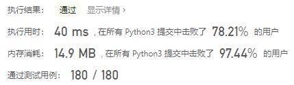
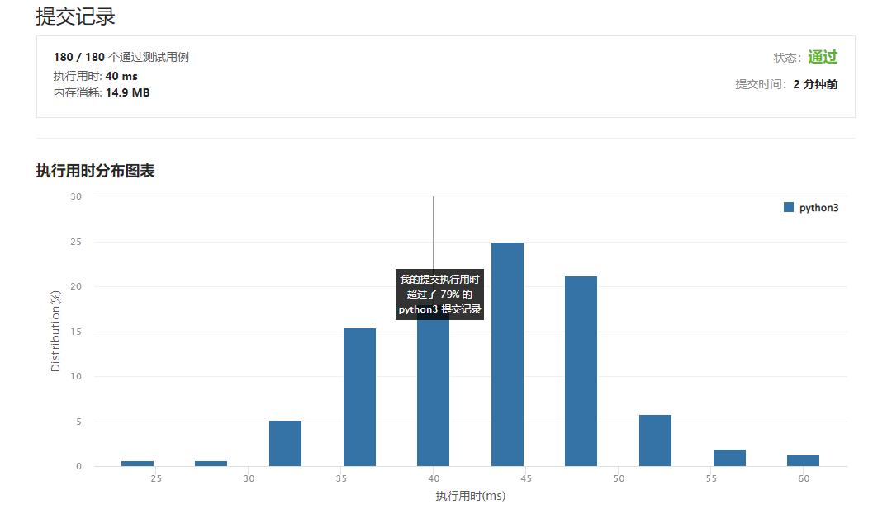

# 1636-按照频率将数组升序排序

Author：_Mumu

创建日期：2022/09/19

通过日期：2022/09/19

*****

踩过的坑：

1. 轻松愉快

已解决：467/2782

*****

难度：简单

问题描述：

给你一个整数数组 nums ，请你将数组按照每个值的频率 升序 排序。如果有多个值的频率相同，请你按照数值本身将它们 降序 排序。 

请你返回排序后的数组。

 

示例 1：

输入：nums = [1,1,2,2,2,3]
输出：[3,1,1,2,2,2]
解释：'3' 频率为 1，'1' 频率为 2，'2' 频率为 3 。
示例 2：

输入：nums = [2,3,1,3,2]
输出：[1,3,3,2,2]
解释：'2' 和 '3' 频率都为 2 ，所以它们之间按照数值本身降序排序。
示例 3：

输入：nums = [-1,1,-6,4,5,-6,1,4,1]
输出：[5,-1,4,4,-6,-6,1,1,1]

提示：

1 <= nums.length <= 100
-100 <= nums[i] <= 100

来源：力扣（LeetCode）
链接：https://leetcode.cn/problems/sort-array-by-increasing-frequency