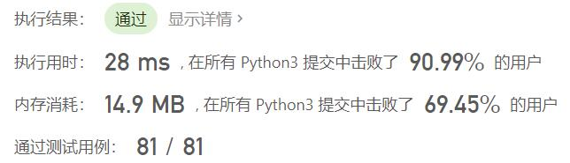
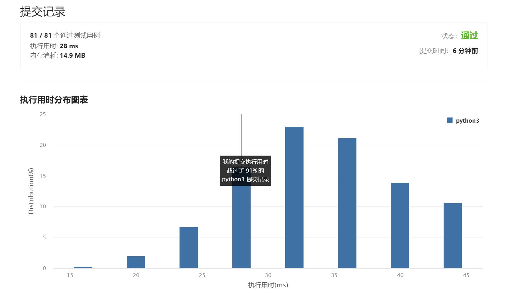

# 165-比较版本号

Author：_Mumu

创建日期：2021/9/1

通过日期：2021/9/1

*****

踩过的坑：

1. 不得不说，有点简单
2. 一开始忘记了字符串分割函数，于是正好就用了最优解法双指针
3. 不过与题解相比最开始的写法比较笨，长度不同的版本号尾部处理我选择另外解决
4. 看了题解之后才发现可以直接通过修改判断条件并设定一个初值合并解决
5. 与题解相比劣势在于我使用字符串存储中间版本号，这样就导致我的临时存储变量初值必须设为`'0'`，否则在合并处理尾部时会因为`int('')`报错；另外字符串存储应该比数字占用了更大的空间

已解决：73/2332

*****

难度：中等

问题描述：

给你两个版本号 version1 和 version2 ，请你比较它们。

版本号由一个或多个修订号组成，各修订号由一个 '.' 连接。每个修订号由 多位数字 组成，可能包含 前导零 。每个版本号至少包含一个字符。修订号从左到右编号，下标从 0 开始，最左边的修订号下标为 0 ，下一个修订号下标为 1 ，以此类推。例如，2.5.33 和 0.1 都是有效的版本号。

比较版本号时，请按从左到右的顺序依次比较它们的修订号。比较修订号时，只需比较 忽略任何前导零后的整数值 。也就是说，修订号 1 和修订号 001 相等 。如果版本号没有指定某个下标处的修订号，则该修订号视为 0 。例如，版本 1.0 小于版本 1.1 ，因为它们下标为 0 的修订号相同，而下标为 1 的修订号分别为 0 和 1 ，0 < 1 。

返回规则如下：

如果 version1 > version2 返回 1，
如果 version1 < version2 返回 -1，
除此之外返回 0。

示例 1：

输入：version1 = "1.01", version2 = "1.001"
输出：0
解释：忽略前导零，"01" 和 "001" 都表示相同的整数 "1"
示例 2：

输入：version1 = "1.0", version2 = "1.0.0"
输出：0
解释：version1 没有指定下标为 2 的修订号，即视为 "0"
示例 3：

输入：version1 = "0.1", version2 = "1.1"
输出：-1
解释：version1 中下标为 0 的修订号是 "0"，version2 中下标为 0 的修订号是 "1" 。0 < 1，所以 version1 < version2
示例 4：

输入：version1 = "1.0.1", version2 = "1"
输出：1
示例 5：

输入：version1 = "7.5.2.4", version2 = "7.5.3"
输出：-1

提示：

1 <= version1.length, version2.length <= 500
version1 和 version2 仅包含数字和 '.'
version1 和 version2 都是 有效版本号
version1 和 version2 的所有修订号都可以存储在 32 位整数 中

来源：力扣（LeetCode）
链接：https://leetcode-cn.com/problems/compare-version-numbers
