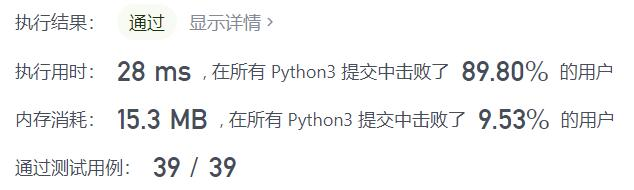
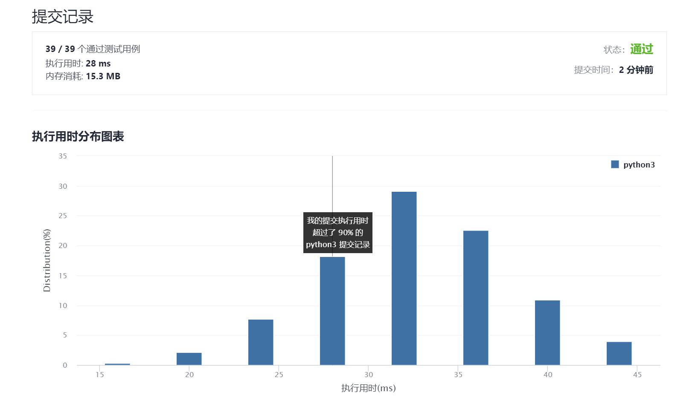

# 166-分数到小数

Author：_Mumu

创建日期：2021/10/3

通过日期：2021/10/3

*****

踩过的坑：

1. 好牛
2. 记录每一步的余数真是太聪明了
3. 记得处理正负号

已解决：105/2385

*****

难度：中等

问题描述：

给定两个整数，分别表示分数的分子 numerator 和分母 denominator，以 字符串形式返回小数 。

如果小数部分为循环小数，则将循环的部分括在括号内。

如果存在多个答案，只需返回 任意一个 。

对于所有给定的输入，保证 答案字符串的长度小于 104 。

 

示例 1：

输入：numerator = 1, denominator = 2
输出："0.5"
示例 2：

输入：numerator = 2, denominator = 1
输出："2"
示例 3：

输入：numerator = 2, denominator = 3
输出："0.(6)"
示例 4：

输入：numerator = 4, denominator = 333
输出："0.(012)"
示例 5：

输入：numerator = 1, denominator = 5
输出："0.2"

提示：

-231 <= numerator, denominator <= 231 - 1
denominator != 0

来源：力扣（LeetCode）
链接：https://leetcode-cn.com/problems/fraction-to-recurring-decimal
