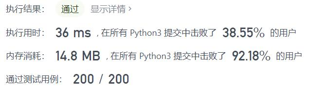
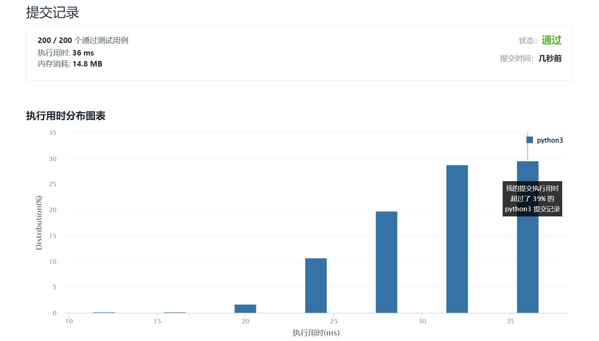

# 1688-比赛中的配对次数

Author：_Mumu

创建日期：2022/01/25

通过日期：2022/01/25

*****

踩过的坑：

1. 草
2. 绝了，一开始还在想会不会跟二进制有关，然后一看咋都是$n-1$，等等这么想的话好像只有比赛才会淘汰，淘汰一队就有一场比赛，那只剩一队还真就是$n-1$

已解决：232/2506

*****

难度：简单

问题描述：

给你一个整数 n ，表示比赛中的队伍数。比赛遵循一种独特的赛制：

如果当前队伍数是 偶数 ，那么每支队伍都会与另一支队伍配对。总共进行 n / 2 场比赛，且产生 n / 2 支队伍进入下一轮。
如果当前队伍数为 奇数 ，那么将会随机轮空并晋级一支队伍，其余的队伍配对。总共进行 (n - 1) / 2 场比赛，且产生 (n - 1) / 2 + 1 支队伍进入下一轮。
返回在比赛中进行的配对次数，直到决出获胜队伍为止。

 

示例 1：

输入：n = 7
输出：6
解释：比赛详情：
- 第 1 轮：队伍数 = 7 ，配对次数 = 3 ，4 支队伍晋级。
- 第 2 轮：队伍数 = 4 ，配对次数 = 2 ，2 支队伍晋级。
- 第 3 轮：队伍数 = 2 ，配对次数 = 1 ，决出 1 支获胜队伍。
总配对次数 = 3 + 2 + 1 = 6
示例 2：

输入：n = 14
输出：13
解释：比赛详情：
- 第 1 轮：队伍数 = 14 ，配对次数 = 7 ，7 支队伍晋级。
- 第 2 轮：队伍数 = 7 ，配对次数 = 3 ，4 支队伍晋级。 
- 第 3 轮：队伍数 = 4 ，配对次数 = 2 ，2 支队伍晋级。
- 第 4 轮：队伍数 = 2 ，配对次数 = 1 ，决出 1 支获胜队伍。
总配对次数 = 7 + 3 + 2 + 1 = 13

提示：

1 <= n <= 200

来源：力扣（LeetCode）
链接：https://leetcode-cn.com/problems/count-of-matches-in-tournament
