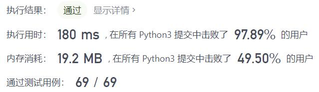
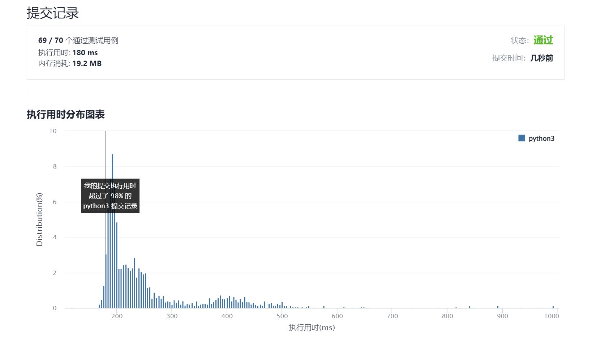

# 1705-吃苹果的最大数目

Author：_Mumu

创建日期：2021/12/24

通过日期：2021/12/24

*****

踩过的坑：

1. 平安夜啦，准备快乐圣诞趴！
2. 所以平安夜吃苹果怎么来的到底
3. 一开始没发现有时候先吃晚结出的苹果还能让总数最大，后来才知道应该直接贪心先吃早烂的苹果
4. 于是涉及到实时排序并提取最小值，一开始想到用了`SortedDict`，但是这个耗时太大，不太行
5. 还是小根堆舒服

已解决：186/2468

*****

难度：中等

问题描述：

有一棵特殊的苹果树，一连 n 天，每天都可以长出若干个苹果。在第 i 天，树上会长出 apples[i] 个苹果，这些苹果将会在 days[i] 天后（也就是说，第 i + days[i] 天时）腐烂，变得无法食用。也可能有那么几天，树上不会长出新的苹果，此时用 apples[i] == 0 且 days[i] == 0 表示。

你打算每天 最多 吃一个苹果来保证营养均衡。注意，你可以在这 n 天之后继续吃苹果。

给你两个长度为 n 的整数数组 days 和 apples ，返回你可以吃掉的苹果的最大数目。

 

示例 1：

输入：apples = [1,2,3,5,2], days = [3,2,1,4,2]
输出：7
解释：你可以吃掉 7 个苹果：
- 第一天，你吃掉第一天长出来的苹果。
- 第二天，你吃掉一个第二天长出来的苹果。
- 第三天，你吃掉一个第二天长出来的苹果。过了这一天，第三天长出来的苹果就已经腐烂了。
- 第四天到第七天，你吃的都是第四天长出来的苹果。
示例 2：

输入：apples = [3,0,0,0,0,2], days = [3,0,0,0,0,2]
输出：5
解释：你可以吃掉 5 个苹果：
- 第一天到第三天，你吃的都是第一天长出来的苹果。
- 第四天和第五天不吃苹果。
- 第六天和第七天，你吃的都是第六天长出来的苹果。

提示：

apples.length == n
days.length == n
1 <= n <= 2 * 104
0 <= apples[i], days[i] <= 2 * 104
只有在 apples[i] = 0 时，days[i] = 0 才成立

来源：力扣（LeetCode）
链接：https://leetcode-cn.com/problems/maximum-number-of-eaten-apples
