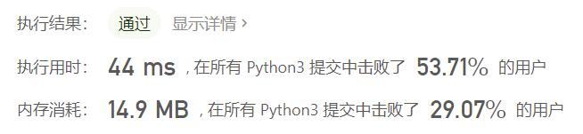
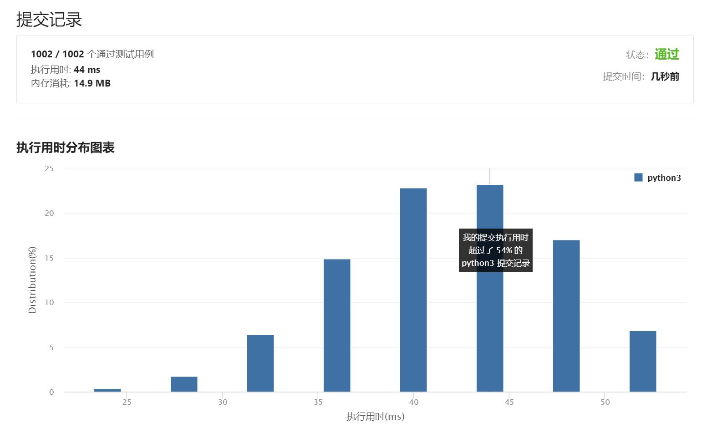

# 171-Excel表列序号

Author：_Mumu

创建日期：2021/6/29

通过日期：2021/6/29

*****

踩过的坑：

1. 我起了，一刀秒了，没啥好说的

已解决：29/2141

*****

难度：简单

问题描述：

给定一个Excel表格中的列名称，返回其相应的列序号。

例如，

    A -> 1
    B -> 2
    C -> 3
    ...
    Z -> 26
    AA -> 27
    AB -> 28 
    ...
示例 1:

输入: "A"
输出: 1
示例 2:

输入: "AB"
输出: 28
示例 3:

输入: "ZY"
输出: 701
致谢：
特别感谢 @ts 添加此问题并创建所有测试用例。

来源：力扣（LeetCode）
链接：https://leetcode-cn.com/problems/excel-sheet-column-number