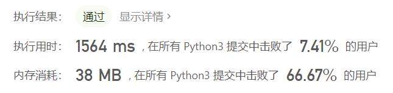
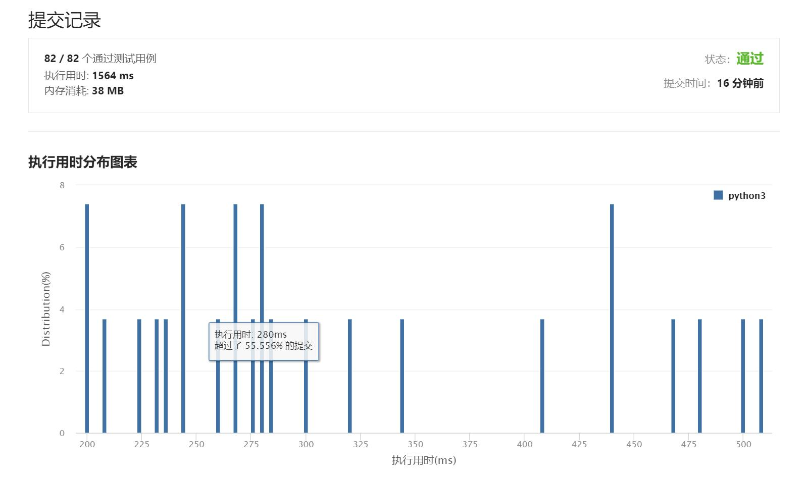

# 1713-得到子序列的最少操作次数

Author：_Mumu

创建日期：2021/7/26

通过日期：2021/7/26

*****

踩过的坑：

1. 好难，想到了最长公共子序列，但是没想到最长递增序列
2. 思路就是首先题目可以转化为求两数组最长公共子序列的问题，但是因为最长公共子序列算法时间复杂度的问题，还需要进一步转化
3. 根据`target`数组各元素唯一性，把`arr`数组中非`target`数组元素删去，而`target`数组元素改为其在`target`中的下标，于是问题转化为求删改后的`arr1`数组最长递增子序列的问题
4. 最长递增子序列的算法步骤为：创建一个空数组`d`，遍历删改后的`arr1`数组，若`d`空或`arr1[i] > d[-1]`，则将`arr1[i]`加入`d`；否则，找到第一个`d[j] > arr1[i]`，将`d[j]`替换为`arr1[i]`，最后返回`len(target) - len(d)`
5. 可谓妙绝
6. 值得注意的是，创建`target: list`元素与下标对应哈希表`target_idx: dict`后，使用`if num in target`进行判断的时间消耗要大于`if num in target_idx`，会导致超出时间限制
7. 另外使用`bisect.bisect_left()`函数能够减少传统二分法之前需要进行的额外的判断操作，使代码变得更加优雅快速

已解决：53/2173

*****

难度：困难

问题描述：

给你一个数组 target ，包含若干 互不相同 的整数，以及另一个整数数组 arr ，arr 可能 包含重复元素。

每一次操作中，你可以在 arr 的任意位置插入任一整数。比方说，如果 arr = [1,4,1,2] ，那么你可以在中间添加 3 得到 [1,4,3,1,2] 。你可以在数组最开始或最后面添加整数。

请你返回 最少 操作次数，使得 target 成为 arr 的一个子序列。

一个数组的 子序列 指的是删除原数组的某些元素（可能一个元素都不删除），同时不改变其余元素的相对顺序得到的数组。比方说，[2,7,4] 是 [4,2,3,7,2,1,4] 的子序列（加粗元素），但 [2,4,2] 不是子序列。

 

示例 1：

输入：target = [5,1,3], arr = [9,4,2,3,4]
输出：2
解释：你可以添加 5 和 1 ，使得 arr 变为 [5,9,4,1,2,3,4] ，target 为 arr 的子序列。
示例 2：

输入：target = [6,4,8,1,3,2], arr = [4,7,6,2,3,8,6,1]
输出：3

提示：

1 <= target.length, arr.length <= 105
1 <= target[i], arr[i] <= 109
target 不包含任何重复元素。

来源：力扣（LeetCode）
链接：https://leetcode-cn.com/problems/minimum-operations-to-make-a-subsequence